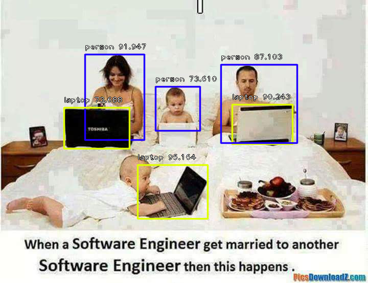
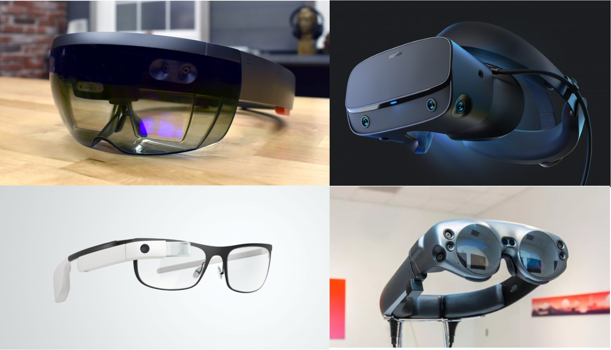
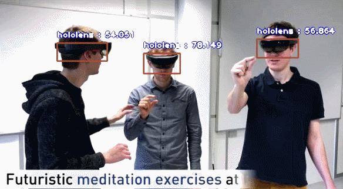

# ImageAI (v3.0.3)


[](https://travis-ci.com/OlafenwaMoses/ImageAI)  [](https://github.com/OlafenwaMoses/ImageAI/blob/master/LICENSE) [](https://badge.fury.io/py/imageai)   [](https://pepy.tech/project/imageai) [](https://pepy.tech/project/imageai)

An open-source python library built to empower developers to build applications and systems with self-contained Deep Learning and Computer Vision capabilities using simple and few lines of code.
 
 If you will like to sponsor this project, kindly visit the <strong>[Github sponsor page](https://github.com/sponsors/OlafenwaMoses)</strong>.
 
 
## ---------------------------------------------------
## ImageAI now uses **PyTorch** backend.
As from ImageAI `3.0.2`, the library now uses PyTorch has the backend. For full details on this and if you plan on using existing Tensorflow pretrained models, custom models and Pascal VOC dataset, visit the [BACKEND_MIGRATION.md](BACKEND_MIGRATION.md) documentation.
## ---------------------------------------------------
 


Developed and maintained by [Moses Olafenwa](https://twitter.com/OlafenwaMoses)

---

Built with simplicity in mind, **ImageAI** 
    supports a list of state-of-the-art Machine Learning algorithms for image prediction, custom image prediction, object detection, video detection, video object tracking
    and image predictions trainings. **ImageAI** currently supports image prediction and training using 4 different Machine Learning algorithms 
    trained on the ImageNet-1000 dataset. **ImageAI** also supports object detection, video detection and object tracking  using RetinaNet, YOLOv3 and TinyYOLOv3 trained on COCO dataset. Finally, **ImageAI** allows you to train custom models for performing detection and recognition of new objects. 
   
Eventually, **ImageAI** will provide support for a wider and more specialized aspects of Computer Vision


**New Release : ImageAI 3.0.2**

What's new:
- PyTorch backend
- TinyYOLOv3 model training


### TABLE OF CONTENTS
- <a href="#installation" > :white_square_button: Installation</a>
- <a href="#features" > :white_square_button: Features</a>
- <a href="#documentation" > :white_square_button: Documentation</a>
- <a href="#sponsors" > :white_square_button: Sponsors</a>
- <a href="#sample" > :white_square_button: Projects Built on ImageAI</a>
- <a href="#real-time-and-high-performance-implementation" > :white_square_button: High Performance Implementation</a>
- <a href="#recommendation" > :white_square_button: AI Practice Recommendations</a>
- <a href="#contact" > :white_square_button: Contact Developers</a>
- <a href="#citation" > :white_square_button: Citation</a>
- <a href="#ref" > :white_square_button: References</a>


## Installation
<div id="installation"></div>
 
To install ImageAI, run the python installation instruction below in the command line:

- [Download and Install](https://www.python.org/downloads/) **Python 3.7**, **Python 3.8**, **Python 3.9** or **Python 3.10**
- Install dependencies
  - **CPU**: Download [requirements.txt](https://github.com/OlafenwaMoses/ImageAI/blob/master/requirements.txt) file and install via the command
    ```
    pip install -r requirements.txt
    ```
    or simply copy and run the command below

    ```
    pip install cython pillow>=7.0.0 numpy>=1.18.1 opencv-python>=4.1.2 torch>=1.9.0 --extra-index-url https://download.pytorch.org/whl/cpu torchvision>=0.10.0 --extra-index-url https://download.pytorch.org/whl/cpu pytest==7.1.3 tqdm==4.64.1 scipy>=1.7.3 matplotlib>=3.4.3 mock==4.0.3
    ```

  - **GPU/CUDA**: Download [requirements_gpu.txt](https://github.com/OlafenwaMoses/ImageAI/blob/master/requirements_gpu.txt) file and install via the command
    ```
    pip install -r requirements_gpu.txt
    ```
    or smiply copy and run the command below
    ```
    pip install cython pillow>=7.0.0 numpy>=1.18.1 opencv-python>=4.1.2 torch>=1.9.0 --extra-index-url https://download.pytorch.org/whl/cu102 torchvision>=0.10.0 --extra-index-url https://download.pytorch.org/whl/cu102 pytest==7.1.3 tqdm==4.64.1 scipy>=1.7.3 matplotlib>=3.4.3 mock==4.0.3
    ```
- If you plan to train custom AI models, download [requirements_extra.txt](https://github.com/OlafenwaMoses/ImageAI/blob/master/requirements_extra.txt) file and install via the command
  
  ```
  pip install -r requirements_extra.txt
  ```
  or simply copy and run the command below
  ```
  pip install pycocotools@git+https://github.com/gautamchitnis/cocoapi.git@cocodataset-master#subdirectory=PythonAPI
  ```
- Then run the command below to install ImageAI
  ```
  pip install imageai --upgrade
  ```

## Features
<div id="features"></div>
<table>
  <tr>
    <td><h2> Image Classification</h2> </td>
  </tr>
  <tr>
    <td>
    <h4>ImageAI provides 4 different algorithms and model types to perform image prediction, trained on the ImageNet-1000 dataset. The 4 algorithms provided for image prediction include MobileNetV2, ResNet50, InceptionV3 and DenseNet121.
    Click the link below to see the full sample codes, explanations and best practices guide.</h4>
    <a href="imageai/Classification"> >>> Get Started</a>
    </td>
  </tr>
  
 </table>

 <div id="features"></div>
<table>
  <tr>
    <td><h2> Object Detection </h2> </td>
  </tr>
  <tr>
    <td>
        
        <h4>ImageAI provides very convenient and powerful methods to perform object detection on images and extract each object from the image. The object detection class provides support for RetinaNet, YOLOv3 and TinyYOLOv3, with options to adjust for state of the art performance or real time processing. Click the link below to see the full sample codes, explanations and best practices guide.</h4>
    <a href="imageai/Detection"> >>> Get Started</a>
    </td>
  </tr>
  
 </table>


<table>
  <tr>
    <td><h2> Video Object Detection & Analysis</h2> </td>
  </tr>
  <tr>
    <td>
    <h4>ImageAI provides very convenient and powerful methods to perform object detection in videos. The video object detection class provided only supports the current state-of-the-art RetinaNet. Click the link to see the full videos, sample codes, explanations and best practices guide.</h4>
    <a href="imageai/Detection/VIDEO.md"> >>> Get Started</a>
    </td>
  </tr>
  
 </table>


 <table>
  <tr>
    <td><h2> Custom Classification model training </h2> </td>
  </tr>
  <tr>
    <td>
        
        <h4>ImageAI provides classes and methods for you to train a new model that can be used to perform prediction on your own custom objects. You can train your custom models using MobileNetV2, ResNet50, InceptionV3 and DenseNet in 5 lines of code. Click the link below to see the guide to preparing training images, sample training codes, explanations and best practices.</h4>
    <a href="imageai/Classification/CUSTOMTRAINING.md"> >>> Get Started</a>
    </td>
  </tr>
  
 </table>

 <table>
  <tr>
    <td><h2> Custom Model Classification</h2> </td>
  </tr>
  <tr>
    <td>
    <h4>ImageAI provides classes and methods for you to run image prediction your own custom objects using your own model trained with ImageAI Model Training class. You can use your custom models trained with MobileNetV2, ResNet50, InceptionV3 and DenseNet and the JSON file containing the mapping of the custom object names. Click the link below to see the guide to sample training codes, explanations, and best practices guide.</h4>
    <a href="imageai/Classification/CUSTOMCLASSIFICATION.md"> >>> Get Started</a>
    </td>
  </tr>
  
 </table>

 <table>
  <tr>
    <td><h2> Custom Detection Model Training </h2> </td>
  </tr>
  <tr>
    <td>
        
        <h4>ImageAI provides classes and methods for you to train new YOLOv3 or TinyYOLOv3 object detection models on your custom dataset. This means you can train a model to detect literally any object of interest by providing the images, the annotations and training with ImageAI. Click the link below to see the guide to sample training codes, explanations, and best practices guide.</h4>
    <a href="imageai/Detection/Custom/CUSTOMDETECTIONTRAINING.md"> >>> Get Started</a>
    </td>
  </tr>
  
 </table>

<table>
  <tr>
    <td><h2> Custom Object Detection</h2> </td>
  </tr>
  <tr>
    <td>
    <h4>ImageAI now provides classes and methods for you detect and recognize your own custom objects in images using your own model trained with the DetectionModelTrainer class. You can use your custom trained YOLOv3 or TinyYOLOv3 model and the **.json** file generated during the training. Click the link below to see the guide to sample training codes, explanations, and best practices guide.</h4>
    <a href="imageai/Detection/Custom/CUSTOMDETECTION.md"> >>> Get Started</a>
    </td>
  </tr>
 </table>


<table>
  <tr>
    <td><h2> Custom Video Object Detection & Analysis </h2> </td>
  </tr>
  <tr>
    <td>
        
        <h4>ImageAI now provides classes and methods for you detect and recognize your own custom objects in images using your own model trained with the DetectionModelTrainer class. You can use your custom trained YOLOv3 or TinyYOLOv3 model and the **.json** file generated during the training. Click the link below to see the guide to sample training codes, explanations, and best practices guide.</h4>
    <a href="imageai/Detection/Custom/CUSTOMVIDEODETECTION.md"> >>> Get Started</a>
    </td>
  </tr>
 </table>

## Documentation
<div id="documentation"></div>

We have provided full documentation for all **ImageAI** classes and functions. Visit the link below:

- Documentation - **English Version**  [https://imageai.readthedocs.io](https://imageai.readthedocs.io)


## Sponsors
<div id="sponsors"></div>


## Real-Time and High Performance Implementation
<div id="performance"></div>

**ImageAI** provides abstracted and convenient implementations of state-of-the-art Computer Vision technologies. All of **ImageAI** implementations and code can work on any computer system with moderate CPU capacity. However, the speed of processing for operations like image prediction, object detection and others on CPU is slow and not suitable for real-time applications. To perform real-time Computer Vision operations with high performance, you need to use GPU enabled technologies.

**ImageAI** uses the PyTorch backbone for it's Computer Vision operations. PyTorch supports both CPUs and GPUs ( Specifically NVIDIA GPUs.  You can get one for your PC or get a PC that has one) for machine learning and artificial intelligence algorithms' implementations.


## Projects Built on ImageAI
<div id="sample"></div>


## AI Practice Recommendations
<div id="recommendation"></div>

For anyone interested in building AI systems and using them for business, economic,  social and research purposes, it is critical that the person knows the likely positive, negative and unprecedented impacts the use of such technologies will have.
They must also be aware of approaches and practices recommended by experienced industry experts to ensure every use of AI brings overall benefit to mankind.
We therefore recommend to everyone that wishes to use ImageAI and other AI tools and resources to read Microsoft's January 2018 publication on AI titled "The Future Computed : Artificial Intelligence and its role in society".
Kindly follow the link below to download the publication.

[https://blogs.microsoft.com/blog/2018/01/17/future-computed-artificial-intelligence-role-society](https://blogs.microsoft.com/blog/2018/01/17/future-computed-artificial-intelligence-role-society/)

### Contact Developer
<div id="contact"></div>

- **Moses Olafenwa**
    * _Email:_ guymodscientist@gmail.com
    * _Twitter:_ [@OlafenwaMoses](https://twitter.com/OlafenwaMoses)
    * _Medium:_ [@guymodscientist](https://medium.com/@guymodscientist)
    * _Facebook:_ [moses.olafenwa](https://facebook.com/moses.olafenwa)
- **John Olafenwa**
    * _Email:_ johnolafenwa@gmail.com
    * _Website:_ [https://john.aicommons.science](https://john.aicommons.science)
    * _Twitter:_ [@johnolafenwa](https://twitter.com/johnolafenwa)
    * _Medium:_ [@johnolafenwa](https://medium.com/@johnolafenwa)
    * _Facebook:_ [olafenwajohn](https://facebook.com/olafenwajohn)


### Citation
<div id="citation"></div>

You can cite **ImageAI** in your projects and research papers via the **BibTeX** entry below.  
  
```
@misc {ImageAI,
    author = "Moses",
    title  = "ImageAI, an open source python library built to empower developers to build applications and systems  with self-contained Computer Vision capabilities",
    url    = "https://github.com/OlafenwaMoses/ImageAI",
    month  = "mar",
    year   = "2018--"
}
```


 ### References
 <div id="ref"></div>

 1. Somshubra Majumdar, DenseNet Implementation of the paper, Densely Connected Convolutional Networks in Keras
[https://github.com/titu1994/DenseNet](https://github.com/titu1994/DenseNet)
 2. Broad Institute of MIT and Harvard, Keras package for deep residual networks
[https://github.com/broadinstitute/keras-resnet](https://github.com/broadinstitute/keras-resnet)
 3. Fizyr, Keras implementation of RetinaNet object detection
[https://github.com/fizyr/keras-retinanet](https://github.com/fizyr/keras-retinanet)
 4. Francois Chollet, Keras code and weights files for popular deeplearning models
[https://github.com/fchollet/deep-learning-models](https://github.com/fchollet/deep-learning-models)
 5. Forrest N. et al, SqueezeNet: AlexNet-level accuracy with 50x fewer parameters and <0.5MB model size
[https://arxiv.org/abs/1602.07360](https://arxiv.org/abs/1602.07360)
 6. Kaiming H. et al, Deep Residual Learning for Image Recognition
[https://arxiv.org/abs/1512.03385](https://arxiv.org/abs/1512.03385)
 7. Szegedy. et al, Rethinking the Inception Architecture for Computer Vision
[https://arxiv.org/abs/1512.00567](https://arxiv.org/abs/1512.00567)
 8. Gao. et al, Densely Connected Convolutional Networks
[https://arxiv.org/abs/1608.06993](https://arxiv.org/abs/1608.06993)
 9. Tsung-Yi. et al, Focal Loss for Dense Object Detection
[https://arxiv.org/abs/1708.02002](https://arxiv.org/abs/1708.02002)
 10. O Russakovsky et al, ImageNet Large Scale Visual Recognition Challenge
[https://arxiv.org/abs/1409.0575](https://arxiv.org/abs/1409.0575)
 11. TY Lin et al, Microsoft COCO: Common Objects in Context
[https://arxiv.org/abs/1405.0312](https://arxiv.org/abs/1405.0312)
 12. Moses & John Olafenwa, A collection of images of identifiable professionals.
[https://github.com/OlafenwaMoses/IdenProf](https://github.com/OlafenwaMoses/IdenProf)
 13. Joseph Redmon and Ali Farhadi, YOLOv3: An Incremental Improvement.
[https://arxiv.org/abs/1804.02767](https://arxiv.org/abs/1804.02767)
 14. Experiencor, Training and Detecting Objects with YOLO3
[https://github.com/experiencor/keras-yolo3](https://github.com/experiencor/keras-yolo3)
 15. MobileNetV2: Inverted Residuals and Linear Bottlenecks
[https://arxiv.org/abs/1801.04381](https://arxiv.org/abs/1801.04381)
 16. YOLOv3 in PyTorch > ONNX > CoreML > TFLite [https://github.com/ultralytics/yolov3](https://github.com/ultralytics/yolov3)