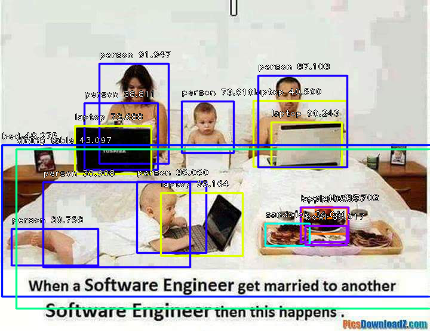

# ImageAI
A python library built to empower developers to build applications and systems  with self-contained Computer Vision capabilities

Built with simplicity in mind, ImageAI 
    supports a list of state-of-the-art Machine Learning algorithms for image recognition.
    ImageAI currently supports image recognition using 4 different Machine Learning algorithms 
    trained on the ImageNet-1000 dataset, meaning any application built with <b>ImageAI</b>
    can recognize 1000 distinct objects including vehicles, animals, plants, places, electronics,
    indoor objects, outdoor objects and more.  
                                   Eventually, <b>ImageAI</b> will provide support for a wider
    and more specialized aspects of Computer Vision including and not limited to image 
    recognition in special environments and special fields and custom image
    prediction.

 

<b>New Release : ImageAI 1.0.2</b>
  What's new:
 
- Addition of Object Detection class  
- Addition of multiple images prediction function  
- Removal of the need for ImageNet-1000 JSON file for image prediction  
- New Dependencies to support Object Detection (find them in the dependencies section below)  
- Bug Fixes

 

<h3><b><u>TABLE OF CONTENTS</u></b></h3>
<a href="#dependencies" >&#9635 Dependencies</a> 
<a href="#installation" >&#9635 Installation</a> 
<a href="#prediction" >&#9635 Using ImageAI for Image Prediction</a> 
<a href="#multiprediction" >&#9635 Multiple Images Prediction</a> 
<a href="#threadprediction" >&#9635 Using ImageAI in MultiThreading</a> 
<a href="#detection" >&#9635 Using ImageAI for Object Detection</a> 
<a href="#detectionextraction" >&#9635 Object Detection, Extraction and Fine-Tuning</a> 
<a href="#performance" >&#9635 Real-Time and High Perfomance Implementation</a> 
<a href="#sample" >&#9635 Sample Applications</a> 
<a href="#documentation" >&#9635 Documentation</a> 
<a href="#recommendation" >&#9635 AI Practice Recommendations</a> 
<a href="#contact" >&#9635 Contact Developers</a> 
<a href="#ref" >&#9635 References</a> 

  

<h3><b><u>Dependencies</u></b></h3>
                            To use <b>ImageAI</b> in your application developments, you must have installed the following 
 dependencies before you install <b>ImageAI</b> : 
 

 
    
       <b>- Python 3.5.1 (and later versions) </b>      <a href="https://www.python.org/downloads/" style="text-decoration: none;" >Download<a> (Support for Python 2.7 coming soon)    
       <b>- pip3 </b>              <a href="https://pypi.python.org/pypi/pip" style="text-decoration: none;" >Install<a>  
       <b>- Tensorflow 1.4.0 (and later versions)  </b>      <a href="https://www.tensorflow.org/install/install_windows" style="text-decoration: none;" > Install<a>  
       <b>- Numpy 1.13.1 (and later versions) </b>      <a href="https://www.scipy.org/install.html" style="text-decoration: none;" >Install<a>  
       <b>- SciPy 0.19.1 (and later versions) </b>      <a href="https://www.scipy.org/install.html" style="text-decoration: none;" >Install<a>  
       <b>- OpenCV  </b> (Required as from ImageAI 1.0.2)       <a href="https://pypi.python.org/pypi/opencv-python" style="text-decoration: none;" >Install<a>  
       <b>- Matplotlib  </b> (Required as from ImageAI 1.0.2)       <a href="https://matplotlib.org/users/installing.html" style="text-decoration: none;" >Install<a>  
       <b>- h5py  </b> (Required as from ImageAI 1.0.2)       <a href="http://docs.h5py.org/en/latest/build.html" style="text-decoration: none;" >Install<a>  
       <b>- Keras 2.x  </b> (Required as from ImageAI 1.0.2)       <a href="https://keras.io/#installation" style="text-decoration: none;" >Install<a>  

 <h3><b><u>Installation</u></b></h3>
      To install ImageAI, run the python installation instruction below in the command line:   
          <b>pip3 install https://github.com/OlafenwaMoses/ImageAI/raw/master/dist/imageai-1.0.2-py3-none-any.whl </b>     
    
   or download the Python Wheel <a href="dist/imageai-1.0.2-py3-none-any.whl" ><b>
    imageai-1.0.2-py3-none-any.whl</b></a> and run the python installation instruction in the  command line
     to the path of the file like the one below:   
          <b>pip3 install C:\User\MyUser\Downloads\imageai-1.0.2-py3-none-any.whl</b>   

<h3><b><u>Using ImageAI for Image Prediction</u></b></h3>
      ImageAI provides 4 different algorithms and model types to perform image prediction.
To perform image prediction on any picture, take the following simple steps.  The 4 algorithms provided for
 image prediction include <b>SqueezeNet</b>, <b>ResNet</b>, <b>InceptionV3</b> and <b>DenseNet</b>. Each of these
  algorithms have individual model files which you must use depending on the choice of your algorithm. To download the
   model file for your choice of algorithm, click on any of the links below:    
       <b>- <a href="https://github.com/rcmalli/keras-squeezenet/releases/download/v1.0/squeezenet_weights_tf_dim_ordering_tf_kernels.h5" style="text-decoration: none;" >SqueezeNet</a> (Size = 4.82 mb, fastest prediction time and moderate accuracy) </b>  
       <b>- <a href="https://github.com/fchollet/deep-learning-models/releases/download/v0.2/resnet50_weights_tf_dim_ordering_tf_kernels.h5" style="text-decoration: none;" >ResNet</a></b> by Microsoft Research <b>(Size = 98 mb, fast prediction time and high accuracy) </b>  
       <b>- <a href="https://github.com/fchollet/deep-learning-models/releases/download/v0.5/inception_v3_weights_tf_dim_ordering_tf_kernels.h5" style="text-decoration: none;" >InceptionV3</a></b> by Google Brain team <b>(Size = 91.6 mb, slow prediction time and higher accuracy) </b>  
       <b>- <a href="https://github.com/titu1994/DenseNet/releases/download/v3.0/DenseNet-BC-121-32.h5" style="text-decoration: none;" >DenseNet</a></b> by Facebook AI Research <b>(Size = 31.6 mb, slower prediction time and highest accuracy) </b>   
 Great! Once you have downloaded this model file, start a new python project, and then copy the model file to your project
     folder where your python files (.py files) will be . Then create a python file and give it a name; an example is <b>FirstPrediction.py</b>.
      Then write the code below into the python file:   

<h3><b>FirstPrediction.py</b></h3>
<b><pre>
from imageai.Prediction import ImagePrediction
import os

execution_path = os.getcwd()
prediction = ImagePrediction()
prediction.setModelTypeAsResNet()
prediction.setModelPath( execution_path + "\\resnet50_weights_tf_dim_ordering_tf_kernels.h5")
prediction.loadModel()

predictions, percentage_probabilities = prediction.predictImage("C:\\Users\\MyUser\\Downloads\\sample.jpg", result_count=5)
for index in range(len(predictions)):
        print(predictions[index] + " : " + percentage_probabilities[index])

</pre></b>

Sample Result:
     
     
    <pre>sports_car : 90.61029553413391
car_wheel : 5.9294357895851135
racer : 0.9972884319722652
convertible : 0.8457873947918415
grille : 0.581052340567112</pre>

 

          The code above works as follows:  
     <b><pre>from imageai.Prediction import ImagePrediction
import os</pre></b>
 
      The code above imports the <b>ImageAI</b> library 
 and the python <b>os</b> class.  
<b><pre>execution_path = os.getcwd()</pre></b>
  The above line obtains the path to the folder that contains
your python file (in this example, your FirstPrediction.py) .  

<b><pre>prediction = ImagePrediction()
prediction.setModelTypeAsResNet()
prediction.setModelPath(execution_path + "\\resnet50_weights_tf_dim_ordering_tf_kernels.h5")</pre></b>
      In the lines above, we created and instance of the <b>ImagePrediction()</b>
 class in the first line, then we set the model type of the prediction object to ResNet by caling the <b>.setModelTypeAsResNet()</b>
  in the second line and then we set the model path of the prediction object to the path of the model file (<b>resnet50_weights_tf_dim_ordering_tf_kernels.h5</b>) we copied to the python file folder
   in the third line.

<b><pre>predictions, percentage_probabilities = prediction.predictImage("C:\\Users\\MyUser\\Downloads\\sample.jpg", result_count=5)</pre></b> In the above line, we defined 2 variables to be equal to the function
 called to predict an image, which is the <b>.predictImage()</b> function, into which we parsed the path to 
 our image and also state the number of prediction results we want to have (values from 1 to 1000) parsing 
 <b> result_count=5 </b>. The <b>.predictImage()</b> function will return 2 array objects with the first (<b>predictions</b>) being
  an array of predictions and the second (<b>percentage_probabilities</b>) being an array of the corresponding percentage probability for each 
  prediction.

  <b><pre>for index in range(len(predictions)):
        print(predictions[index] + " : " + percentage_probabilities[index])</pre></b> The above line obtains each object in the <b>predictions</b> array, and also 
obtains the corresponding percentage probability from the <b>percentage_probabilities</b>, and finally prints
the result of both to console.

  

<h3><b><u>Multiple Images Prediction</u></b></h3>
 You can run image prediction on more than one image using a single function provided as from <b>ImageA1 1.0.2</b> , which is the <b>.predictMultipleImages()</b>
  function. It works by doing the following:   
  - Define your normal <b>ImagePrediction</b> instance  
  - Set the model type and model path  
  - Call the <b>.loadModel()</b> function  
  - Create an array and add all the string path to each of the images you want to predict to the array.  
  - You then perform prediction by calling the <b>.predictMultipleImages()</b> function and parse in the array of images, and also set the number 
   predictions you want per image by parsing <b>result_count_per_image=5</b> (default value is 2)   

  Find the sample code below:  
  <b><pre>import os
from imageai.Prediction import ImagePrediction

execution_path = os.getcwd()

multiple_prediction = ImagePrediction()
multiple_prediction.setModelTypeAsResNet()
multiple_prediction.setModelPath(execution_path + "\\resnet50_weights_tf_dim_ordering_tf_kernels.h5")
multiple_prediction.loadModel()

all_images_array = []

all_files = os.listdir(execution_path)
for each_file in all_files:
    if(each_file.endswith(".jpg") or each_file.endswith(".png")):
        all_images_array.append(each_file)

results_array = multiple_prediction.predictMultipleImages(all_images_array, result_count_per_image=5)
for each_result in results_array:
    predictions, percentage_probabilities = each_result["predictions"], each_result["percentage_probabilities"]
    for index in range(len(predictions)):
        print(predictions[index] + " : " + percentage_probabilities[index])
    print("-----------------------")</pre></b>  
    In the above code, the <b>.predictMultipleImages()</b> function will return an array which contains a dictionary per image. 
 Each dictionary contains the arrays for predictions and percentage probability for each prediction.  
    
Sample Result:
     
    

          
          
          
    

    <pre>convertible : 52.459555864334106
sports_car : 37.61284649372101
pickup : 3.1751200556755066
car_wheel : 1.817505806684494
minivan : 1.7487050965428352
-----------------------
toilet_tissue : 13.99008333683014
jeep : 6.842949986457825
car_wheel : 6.71963095664978
seat_belt : 6.704962253570557
minivan : 5.861184373497963
-----------------------
bustard : 52.03368067741394
vulture : 20.936034619808197
crane : 10.620515048503876
kite : 10.20539253950119
white_stork : 1.6472270712256432
-----------------------</pre>

  

<h3><b><u>Using ImageAI in MultiThreading</u></b></h3>
       When developing programs that run heavy task on the deafult thread like User Interfaces (UI),
 you should consider running your predictions in a new thread. When running image prediction using ImageAI in 
 a new thread, you must take note the following:  
         - You can create your prediction object, set its model type, set model path and json path
outside the new thread.  
          - The <b>.loadModel()</b> must be in the new thread and image prediction (<b>predictImage()</b>) must take place in th new thread.
 
      Take a look of a sample code below on image prediction using multithreading:
<pre><b>
from imageai.Prediction import ImagePrediction
import os
import threading

execution_path = os.getcwd()

prediction = ImagePrediction()
prediction.setModelTypeAsResNet()
prediction.setModelPath( execution_path + "\\resnet50_weights_tf_dim_ordering_tf_kernels.h5")
prediction.setJsonPath(execution_path + "\\imagenet_class_index.json")

picturesfolder = os.environ["USERPROFILE"] + "\\Pictures\\"
allfiles = os.listdir(picturesfolder)

class PredictionThread(threading.Thread):
    def __init__(self):
        threading.Thread.__init__(self)
    def run(self):
        prediction.loadModel()
        for eachPicture in allfiles:
            if eachPicture.endswith(".png") or eachPicture.endswith(".jpg"):
                predictions, percentage_probabilities = prediction.predictImage(picturesfolder + eachPicture, result_count=1)
                for index in range(len(predictions)):
                    print(predictions[index] + " : " + percentage_probabilities[index])

predictionThread = PredictionThread ()
predictionThread.start()
    </b></pre>  

<h3><b><u>Using ImageAI for Object Detection</u></b></h3>
As from <b>ImageAI</b> 1.0.2 , you can now perform Object Detection on images. <b>ImageAI</b> provides very convenient and powerful methods
 to perform object detection on images and extract each object from the image. The object detection class provided only supports
 the current state-of-the-art RetinaNet, while other object detection networks will be supported in the nearest future. To start performing
 object detection, you must download the RetinaNet object detection via the link below:    
 <b>- <a href="https://github.com/fizyr/keras-retinanet/releases/download/0.2/resnet50_coco_best_v2.0.1.h5" style="text-decoration: none;" >RetinaNet</a></b> <b>(Size = 145 mb) </b>   
 Once you download the RetinaNet model file, you should copy the model file to the your project folder where your .py files will be. 
 Then create a python file and give it a name; an example is FirstObjectDetection.py. Then write the code below into the python file:   

 <h3><b>FirstObjectDetection.py</b></h3>

 <b><pre> 
from imageai.Detection import ObjectDetection
import os

execution_path = os.getcwd()

detector = ObjectDetection()
detector.setModelTypeAsRetinaNet()
detector.setModelPath( execution_path + "\\resnet50_coco_best_v2.0.1.h5")
detector.loadModel()

detections = detector.detectObjectsFromImage(execution_path + "\\image2.jpg", execution_path + "\\image2new.jpg")
for eachObject in detections:
    print(eachObject["name"] + " : " + eachObject["percentage_probability"] )
    print("--------------------------------")  </pre></b>
          

 
    
Sample Result:
     
    

          <b>
<i>Input Image</i>
</b>
            
          <b>
<i>Output Image</i>
</b>
          
    
  
<pre>

person : 91.946941614151
--------------------------------
person : 73.61021637916565
--------------------------------
laptop : 90.24320840835571
--------------------------------
laptop : 73.6881673336029
--------------------------------
laptop : 95.16398310661316
--------------------------------
person : 87.10319399833679
--------------------------------

</pre>

 
Let us make a breakdown of the object detection code that we used above. 

<b><pre>
from imageai.Detection import ObjectDetection
import os

execution_path = os.getcwd()      
</pre></b>
 In the 3 lines above , we import the <b>ImageAI object detection </b> class in the first line, import the <b>os</b> in the second line and obtained
  the path to folder where our python file runs.
  <b><pre>
detector = ObjectDetection()
detector.setModelTypeAsRetinaNet()
detector.setModelPath( execution_path + "\\resnet50_coco_best_v2.0.1.h5")
detector.loadModel()
  </pre></b>
  In the 4 lines above, we created a new instance of the <b>ObjectDetection</b> class in the first line, set the model type to RetinaNet in the second line,
  set the model path to the RetinaNet model file we downloaded and copied to the python file folder in the third line and load the model in the
   fourth line.

   <b><pre>
detections = detector.detectObjectsFromImage(execution_path + "\\image2.jpg", execution_path + "\\image2new.jpg")
for eachObject in detections:
    print(eachObject["name"] + " : " + eachObject["percentage_probability"] )
    print("--------------------------------")         
</pre></b>

In the 2 lines above, we ran the <b>detectObjectsFromImage()</b> function and parse in the path to our image, and the path to the new
 image which the function will save. Then the function returns an array of dictionaries with each dictionary corresponding
 to the number of objects detected in the image. Each dictionary has the properties <b>name</b> (name of the object) and 
<b>percentage_probability</b> (percentage probability of the detection)

  

<h3><b><u>Object Detection, Extraction and Fine-tune</u></b></h3>

In the examples we used above, we ran the object detection on an image and it
returned the detected objects in an array as well as save a new image with rectangular markers drawn
 on each object. In our next examples, we will be able to extract each object from the input image
  and save it independently, and also fine-tune the object detection to detect more objects.
   
   
  In the example code below which is very identical to the previous object detction code, we will save each object
   detected as a seperate image.

   <b><pre>
from imageai.Detection import ObjectDetection
import os

execution_path = os.getcwd()

detector = ObjectDetection()
detector.setModelTypeAsRetinaNet()
detector.setModelPath( execution_path + "\\resnet50_coco_best_v2.0.1.h5")
detector.loadModel()

detections, objects_path = detector.detectObjectsFromImage(execution_path + "\\image3.jpg", execution_path + "\\image3new.jpg", save_detected_objects=True)
for eachObject, eachObjectPath in zip(detections, objects_path):
    print(eachObject["name"] + " : " + eachObject["percentage_probability"] )
    print("Object's image saved in " + eachObjectPath)
    print("--------------------------------")

</pre></b>

 
    
Sample Result:
     
    

          <b>
<i>Input Image</i>
</b>
            
          <b>
<i>Output Images</i>
</b>
             

              
            
<i>person</i>

          

          

              
            
<i>person</i>

          

          

              
            
<i>person</i>

          

          

              
            
<i>person</i>

          

          

              
            
<i>motorcycle</i>

          

          

              
            
<i>dog</i>

          

          

              
            
<i>car</i>

          

              
            
<i>person</i>

          

    

   

Let us review the part of the code that perform the object detection and extract the images:

<b><pre>
detections, objects_path = detector.detectObjectsFromImage(execution_path + "\\image3.jpg", execution_path + "\\image3new.jpg", save_detected_objects=True)
for eachObject, eachObjectPath in zip(detections, objects_path):
    print(eachObject["name"] + " : " + eachObject["percentage_probability"] )
    print("Object's image saved in " + eachObjectPath)
    print("--------------------------------")
</pre></b>

In the above above lines, we called the <b>detectObjectsFromImage()</b> , parse in the input image path, output image part, and an
extra parameter <b>save_detected_objects=True</b>. This parameter states that the function extract each object detected from the image
and save it has a seperate image. The parameter is false by default. Once set to <b>true</b>, the function will create a directory
 which is the <b>output image path + "-objects"</b> . Then it saves all the extracted images into this new directory with 
  each image's name being the <b>detected object name + "-" + a number</b> which corresponds to the order at which the objects
  were detected. 
    
This new parameter we set to extract and save detected objects as an image will make the function to return 2 values. The
 first is the array of dictionaries with each dictionary corresponding to a detected object. The second is an array of the paths
  to the saved images of each object detected and extracted, and they are arranged in order at which the objects are in the
  first array.

    
  <b><h3>And one more very important thing before we wrap up on Object Detection!</h3></b> You will recall that the percentage probability
   for each detected object is sent back by the <b>detectObjectsFromImage()</b> function. The function has a parameter 
   <b>minimum_percentage_probability</b> , whose default value is <b>50</b> . That means the function will only return a detected
    object if it's percentage probability is <b>50 or above</b>. The value was kept at this number to ensure the integrity of the
     detection results. However, a number of objects might be skipped in the process. Therefore, let us fine-tune the object
      detection by setting <b>minimum_percentage_probability=30</b> . Take a look at the code below: <b><pre>
from imageai.Detection import ObjectDetection
import os

execution_path = os.getcwd()

detector = ObjectDetection()
detector.setModelTypeAsRetinaNet()
detector.setModelPath( execution_path + "\\resnet50_coco_best_v2.0.1.h5")
detector.loadModel()

detections = detector.detectObjectsFromImage(execution_path + "\\image2.jpg", execution_path + "\\image2new2.jpg", minimum_percentage_probability=30)
for eachObject in detections:
    print(eachObject["name"] + " : " + eachObject["percentage_probability"] )
    print("--------------------------------")
            </pre></b>

 
    
Sample Result:
     
    

          <b>
<i>Input Image</i>
</b>
            
          <b>
<i>Output Image</i>
</b>
          
    

     
<pre>

apple : 35.701966285705566
--------------------------------
apple : 38.37691843509674
--------------------------------
bowl : 49.61664080619812
--------------------------------
sandwich : 34.04079973697662
--------------------------------
bowl : 36.91719174385071
--------------------------------
person : 91.946941614151
--------------------------------
person : 73.61021637916565
--------------------------------
person : 38.810619711875916
--------------------------------
laptop : 40.59039056301117
--------------------------------
laptop : 90.24320840835571
--------------------------------
laptop : 73.6881673336029
--------------------------------
person : 36.050015687942505
--------------------------------
laptop : 95.16398310661316
--------------------------------
person : 30.75830042362213
--------------------------------
person : 87.10319399833679
--------------------------------
person : 35.907524824142456
--------------------------------
bed : 48.27503561973572
--------------------------------
dining table : 43.09736788272858
--------------------------------

</pre>

 
Interesting! You will notice we used the image above for the first object detection. Prevoiously, It detected 3 persons (which
 was suppose to be 4) and 3 laptops (which was suppose to be 4) when the <b>minimum_percentage_probability</b> was at the
  default value of <b>50</b> . In our new code above with <b> minimum_percentage_probability=30 </b>,  the function detected 
   7 persons (not so okay), 3 laptops (not bad), 2 apples (We didn't see that before), 2 bowls (that's great), 1 sandwich, 
   1 bed (Oh, I forgot we had that in there) and a dining table (trust me, the meal didn't belong there). There was significant
 improvement in the number of items detected and a slight mis-detections. The fine-tuning can be increased to have higher detection
  integrity or decreased to capture as many possible items detectable.

    

<h3><b><u>Real-Time and High Perfomance Implementation</u></b></h3>
ImageAI provides abstracted and convenient implementations of state-of-the-art Computer Vision technologies. All of ImageAI implementations and code can work on any computer system with moderate CPU capacity. However, the speed of processing for operations like image prediction, object detection and others on CPU is slow and not suitable for real-time applications. To perform real-time Computer Vision operations with high performance, you need to use GPU enabled technologies. 
   
ImageAI uses the Tensorflow backbone for it's Computer Vision operations. Tensorflow supports both CPUs and GPUs ( Specifically NVIDIA GPUs.  You can get one for your PC or get a PC that has one) for machine learning and artificial intelligence algorithms' implementations. To use Tensorflow that supports the use of GPUs, follow the link below :
   
FOR WINDOWS  
<a href="https://www.tensorflow.org/install/install_windows" >https://www.tensorflow.org/install/install_windows</a>   

FOR macOS  
<a href="https://www.tensorflow.org/install/install_mac" >https://www.tensorflow.org/install/install_mac</a>   

FOR UBUNTU  
<a href="https://www.tensorflow.org/install/install_linux">https://www.tensorflow.org/install/install_linux</a>
  

<h3><b><u>Sample Applications</u></b></h3>
      As a demonstration of  what you can do with ImageAI, we have 
 built a complete AI powered Photo gallery for Windows called <b>IntelliP</b> ,  using <b>ImageAI</b> and UI framework <b>Kivy</b>. Follow this 
 <a href="https://github.com/OlafenwaMoses/IntelliP"  > link </a> to download page of the application and its source code.    

 We also welcome submissions of applications and systems built by you and powered by ImageAI for listings here. Should you want your ImageAI powered 
  developements listed here, you can reach to us via our <a href="#contact" >Contacts</a> below.
 

<h3><b><u>Documentation</u></b></h3>
        The ImageAI library currently supports image prediction via the <b>ImagePrediction</b>
  class and object detection via the <b>ObjectDetection</b> class.

 
     
 The <b>ImagePrediction</b>  class  
 

 

           The <b>ImagePrediction</b> class can be used to perform image prediction
      in any python application by instanciating it and calling the available functions below:  
            <b>- setModelTypeAsSqueezeNet()</b>    This function should be called should you 
      chose to use the SqueezeNet model file for the image prediction. You only need to call it once.  
            <b>- setModelTypeAsResNet()</b>    This function should be called should you 
      chose to use the ResNet model file for the image prediction. You only need to call it once.  
            <b>- setModelTypeAsInceptionV3()</b>    This function should be called should you 
      chose to use the InceptionV3Net model file for the image prediction. You only need to call it once.  
            <b>- setModelTypeAsDenseNet</b>    This function should be called should you 
      chose to use the DenseNet model file for the image prediction. You only need to call it once.  
            <b>- setModelPath()</b>    You need to call this function only once and parse the path to
       the model file path into it. The model file type must correspond to the model type you set.   
             <b>- loadModel()</b>    You need to call this function
        once only before you attempt to call the <b>predictImage()</b> function . 
              <b>- predictImage()</b>    To perform image 
         prediction on an image, you will call this function and parse in the path to the image file
          you want to predict, and also state the number of predictions result you will want to 
           have returned by the function (1 to 1000 posible results). This functions returns two arrays.
           The first one is an array of predictions while the second is an array of corresponding percentage probabilities 
           for each prediction in the prediction array. You can call this function as many times as you need 
           for as many images you want to predict and at any point in your python program as far as you
            have called the required functions to set model type, set model file path, set json file path
             and load the model.   
             <b>- predictMultipleImages()</b>    To perform image 
         prediction on a collection of image, you will call this function and parse in an array that contains the strings 
         of the file path to each image. Then you can set the maximum number of predictions you want to retrieve
          per image. This function returns an array of dictionaries, with each dictionary containing 2 arrays namely 'prediction_results' and 'prediction_probabilities'. The 'prediction_results'
                contains possible objects classes arranged in descending of their percentage probabilities. The 'prediction_probabilities'
                contains the percentage probability of each object class. The position of each object class in the 'prediction_results'
                array corresponds with the positions of the percentage possibilities in the 'prediction_probabilities' array. 
 

  
 The <b>ObjectDetection</b>  class  
 

 

           The <b>ObjectDetection</b> class can be used to perform object detection on images, object
            extraction and more by instanciating it and calling the available functions below:  
            <b>- setModelTypeAsRetinaNet()</b>    This function should be called 
            to use the RetinaNet model file for object detection. You only need to call it once.  
            <b>- setModelPath()</b>    You need to call this function only once and parse the path to
       the model file path into it. The model file type must correspond to the model type you set.   
             <b>- loadModel()</b>    You need to call this function
        once only before you attempt to call the <b>detectObjectsFromImage</b> function . 
        <b>- detectObjectsFromImage()</b>   To perform object detection, you need to call this function and parse in
         the path to input image, the path to save your output image, set the <b>save_detected_objects</b> (optional)  and 
          set the <b>minimum_percentage_probability</b> (optional). 
          This function returns an array of dictionaries, with each dictionary corresponding to the objects
            detected in the image. Each dictionary contains the following property:  
            - name 
            - percentage_probability   
If 'save_detected_objects' is set to 'True', this function will return another array (making 2 arrays
            that will be returned) that contains list of all the paths to the saved image of each object detected  

 

    

 <h3><b><u>AI Practice Recommendations</u></b></h3>

 For anyone interested in building AI systems and using them for business, economic,  social and research purposes, it is critical that the person knows the likely positive, negative and unprecedented impacts the use of such technologies will have. They must also be aware of approaches and practices recommended by experienced industry experts to ensure every use of AI brings overall benefit to mankind. We therefore recommend to everyone that wishes to use ImageAI and other AI tools and resources to read Microsoft's January 2018 publication on AI titled "The Future Computed : Artificial Intelligence and its role in society ".
Kindly follow the link below to download the publication.
   
<a href="https://blogs.microsoft.com/blog/2018/01/17/future-computed-artificial-intelligence-role-society/" >https://blogs.microsoft.com/blog/2018/01/17/future-computed-artificial-intelligence-role-society/</a>
    

 <h3><b><u>Contact Developers</u></b></h3>
 
 <b>Moses Olafenwa</b>  
      <i>Website: </i>    <a style="text-decoration: none;" target="_blank" href="https://moses.specpal.science"> https://moses.specpal.science</a>  
      <i>Twitter: </i>    <a style="text-decoration: none;" target="_blank" href="https://twitter.com/OlafenwaMoses"> @OlafenwaMoses</a>  
      <i>Medium : </i>    <a style="text-decoration: none;" target="_blank" href="https://medium.com/@guymodscientist"> @guymodscientist</a>  
      <i>Facebook : </i>    <a style="text-decoration: none;" target="_blank" href="https://facebook.com/moses.olafenwa"> moses.olafenwa</a>  
  
      <b>John Olafenwa</b>  
      <i>Website: </i>    <a style="text-decoration: none;" target="_blank" href="https://john.specpal.science"> https://john.specpal.science</a>  
      <i>Twitter: </i>    <a style="text-decoration: none;" target="_blank" href="https://twitter.com/johnolafenwa"> @johnolafenwa</a>  
      <i>Medium : </i>    <a style="text-decoration: none;" target="_blank" href="https://medium.com/@johnolafenwa"> @johnolafenwa</a>  
      <i>Facebook : </i>    <a style="text-decoration: none;" href="https://facebook.com/olafenwajohn"> olafenwajohn</a>  

 

  

 

 <h3><b><u>References</u></b></h3>

 1. Refik Can Malli, SqueezeNet v1.1 Implementation using Keras Functional framework 2.0,  
 <a href="https://github.com/rcmalli/keras-squeezenet/" >https://github.com/rcmalli/keras-squeezenet/</a>   

 2. Francois Chollet, Trained image classification models for Keras,  
 <a href="https://github.com/fchollet/deep-learning-models/" >https://github.com/fchollet/deep-learning-models/</a>   

 3. Somshubra Majumdar, DenseNet Implementation of the paper, Densely Connected Convolutional Networks in Keras,  
 <a href="https://github.com/titu1994/DenseNet/" >https://github.com/titu1994/DenseNet/</a>   

 4. Broad Institute of MIT and Harvard, Keras package for deep residual networks,  
 <a href="https://github.com/broadinstitute/keras-resnet" >https://github.com/broadinstitute/keras-resnet</a>   

 5. Fizyr, Keras implementation of RetinaNet object detection,  
 <a href="https://github.com/fizyr/keras-retinanet" >https://github.com/fizyr/keras-retinanet</a>   
