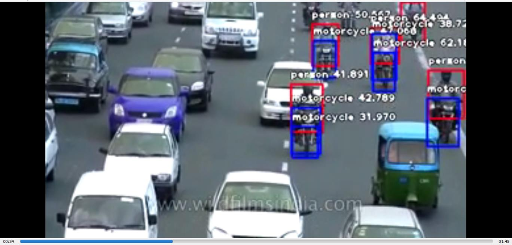

# ImageAI (v2.1.5)

 [](https://travis-ci.com/OlafenwaMoses/ImageAI)  [](https://github.com/OlafenwaMoses/ImageAI/blob/master/LICENSE) [](https://badge.fury.io/py/imageai)   [](https://pepy.tech/project/imageai/month) [](https://pepy.tech/project/imageai/week) [](https://codecov.io/gh/OlafenwaMoses/ImageAI) 

An open-source python library built to empower developers to build applications and systems with self-contained Deep Learning and Computer Vision capabilities using simple
 and few lines of code.
 
 If you will like to back this project, kindly visit the <strong>Patreon</strong> page by clicking the badge below.
 
 <span class="badge-patreon"><a href="https://patreon.com/OlafenwaMoses" title="Donate to this project using Patreon"></a></span> 
 
[ Click here](#sponsors) to see all [sponsors](#sponsors) for the **ImageAI** project!
 


An **DeepQuest AI** (A Brand of AI Commons Global Limited)  project [deepquestai.com](https://deepquestai.com).

Developed and Maintained by [Moses Olafenwa](https://twitter.com/OlafenwaMoses) and [John Olafenwa](https://twitter.com/johnolafenwa), brothers, creators of [TorchFusion](https://github.com/johnolafenwa/TorchFusion), Authors of [Introduction to Deep Computer Vision](https://john.aicommons.science/deepvision) and creators of [DeepStack AI Server](https://deepstack.cc).

---

Built with simplicity in mind, **ImageAI** 
    supports a list of state-of-the-art Machine Learning algorithms for image prediction, custom image prediction, object detection, video detection, video object tracking
    and image predictions trainings. **ImageAI** currently supports image prediction and training using 4 different Machine Learning algorithms 
    trained on the ImageNet-1000 dataset. **ImageAI** also supports object detection, video detection and object tracking  using RetinaNet, YOLOv3 and TinyYOLOv3 trained on COCO dataset. Finally, **ImageAI** allows you to train custom models for performing detection and recognition of new objects. 
   
Eventually, **ImageAI** will provide support for a wider
    and more specialized aspects of Computer Vision including and not limited to image 
    recognition in special environments and special fields.


**New Release : ImageAI 2.1.5**

What's new:

- **Tensorboard** logging for all prediction and detection model training.
- **Progress bar** for detection training
- Allow prediction and detection in multi-threaded code
- Automatic **Multi-GPU** utilization for detection training
- Custom detection model **metrics** retrieval
- Bug fix: change custom model probability from **string to float**


### TABLE OF CONTENTS
- <a href="#dependencies" > :white_square_button: Dependencies</a>
- <a href="#installation" > :white_square_button: Installation</a>
- <a href="#prediction" > :white_square_button: Image Prediction</a>
- <a href="#detection" > :white_square_button: Object Detection</a><br>
- <a href="#videodetection" > :white_square_button: Video Object Detection, Tracking & Analysis</a>
- <a href="#customtraining" > :white_square_button: Custom Model Training</a>
- <a href="#customprediction" > :white_square_button: Custom Image Prediction</a>
- <a href="#customdetectiontraining" > :white_square_button: Custom Detection Model Training</a>
- <a href="#customdetection" > :white_square_button: Custom Object Detection</a>
- <a href="#customvideodetection" > :white_square_button: Custom Video Object Detection & Analysis</a>
- <a href="#documentation" > :white_square_button: Documentation</a>
- <a href="#sample" > :white_square_button: Projects Built on ImageAI</a>
- <a href="#real-time-and-high-performance-implementation" > :white_square_button: High Performance Implementation</a>
- <a href="#recommendation" > :white_square_button: AI Practice Recommendations</a>
- <a href="#contact" > :white_square_button: Contact Developers</a>
- <a href="#citation" > :white_square_button: Citation</a>
- <a href="#sponsors" > :white_square_button: Sponsors</a>
- <a href="#contributors" > :white_square_button: Contributors</a>
- <a href="#ref" > :white_square_button: References</a>


### Dependencies
<div id="dependencies"></div>

To use **ImageAI** in your application developments, you must have installed the following 
 dependencies before you install **ImageAI** : 
 
 - Python 3.5.1 (and later versions)
 - Tensorflow 1.4.0 (and later versions) **(Tensorflow 2.0 coming soon)**
 - OpenCV 
 - Keras 2.x 
 
 ```bash
pip install -U tensorflow keras opencv-python
```

### Installation
<div id="installation"></div>
 
To install ImageAI, run the python installation instruction below in the command line:

```bash
pip3 install imageai --upgrade
```

### Image Prediction
<div id="prediction"></div>


 
```
convertible : 52.459555864334106
sports_car : 37.61284649372101
pickup : 3.1751200556755066
car_wheel : 1.817505806684494
minivan : 1.7487050965428352
```

**ImageAI** provides 4 different algorithms and model types to perform image prediction, trained on the ImageNet-1000 dataset.
The 4 algorithms provided for image prediction include **SqueezeNet**, **ResNet**, **InceptionV3** and **DenseNet**. 

Click the link below to see the full sample codes, explanations and best practices guide.

[>>> Tutorial & Guide](imageai/Prediction/README.md)


### Object Detection
<div id="detection"></div>


```
person : 91.946941614151
--------------------------------
person : 73.61021637916565
--------------------------------
laptop : 90.24320840835571
--------------------------------
laptop : 73.6881673336029
--------------------------------
laptop : 95.16398310661316
--------------------------------
person : 87.10319399833679
--------------------------------
```

**ImageAI** provides very convenient and powerful methods to perform object detection on images and extract each object from the image.
The object detection class provides support for RetinaNet, YOLOv3 and TinyYOLOv3, with options to adjust for state of the art performance or real time processing.

Click the link below to see the full sample codes, explanations and best practices guide.


[>>> Tutorial & Guide](imageai/Detection/README.md)


### Video Object Detection and Tracking
<div id="videodetection"></div>

**Video Object Detection & Analysis**

_Below is a snapshot of a video with objects detected._


          
**Video Custom Object Detection (Object Tracking)**

_Below is a snapshot of a video with only person, bicycle and motorcyle detected._



**Video Analysis Visualization**

_Below is a visualization of video analysis returned by **ImageAI** into a 'per_second' function._


**ImageAI** provides very convenient and powerful methods to perform object detection in videos and track specific object(s).
The video object detection class provided only supports  the current state-of-the-art RetinaNet, but with options to adjust for state of the art performance or real time processing.
Click the link to see the full videos, sample codes, explanations and best practices guide.


[>>> Tutorial & Guide](imageai/Detection/VIDEO.md)

### Custom Model Training
<div id="customtraining"></div>

_A sample from the IdenProf Dataset used to train a Model for predicting professionals._


**ImageAI** provides classes and methods for you to train a new model that can be used to perform prediction on your own custom objects.
You can train your custom models using SqueezeNet, ResNet50, InceptionV3 and DenseNet in  **5** lines of code.
Click the link below to see the guide to preparing training images, sample training codes, explanations and best practices.

[>>> Tutorials & Documentation](imageai/Prediction/CUSTOMTRAINING.md)


### Custom Image Prediction
<div id="customprediction"></div>

_Prediction from a sample model trained on IdenProf, for predicting professionals_


```
mechanic : 76.82620286941528
chef : 10.106072574853897
waiter : 4.036874696612358
police : 2.6663416996598244
pilot : 2.239348366856575
```

**ImageAI** provides classes and methods for you to run image prediction your own custom objects using your own model trained with **ImageAI** Model Training class.
You can use your custom models trained with SqueezeNet, ResNet50, InceptionV3 and DenseNet and the JSON file containing the mapping of the custom object names.
Click the link below to see the guide to sample training codes, explanations, and best practices guide.


[>>> Tutorials & Documentation](imageai/Prediction/CUSTOMPREDICTION.md)


### Custom Detection Model Training
<div id="customdetectiontraining"></div>

_Training detection models to detect and recognize new objects._


**ImageAI** provides classes and methods for you to train new **YOLOv3** object detection models on your **custom dataset**.
This means you can train a model to detect literally any object of interest by providing the images, the annotations and training with ImageAI.
Click the link below to see the guide to sample training codes, explanations, and best practices guide.


[>>> Tutorials & Documentation](imageai/Detection/Custom/CUSTOMDETECTIONTRAINING.md)


### Custom Object Detection
<div id="customdetection"></div>

_Detection result from a custom YOLOv3 model trained to detect the Hololens headset._


```
hololens  :  39.69653248786926  :  [611, 74, 751, 154]
hololens  :  87.6643180847168  :  [23, 46, 90, 79]
hololens  :  89.25175070762634  :  [191, 66, 243, 95]
hololens  :  64.49641585350037  :  [437, 81, 514, 133]
hololens  :  91.78624749183655  :  [380, 113, 423, 138]
```

**ImageAI** now provides classes and methods for you detect and recognize your own custom objects in images using your own model trained with the **DetectionModelTraining** class.
You can use your custom trained **YOLOv3** mode and the **detection_config.json** file generated during the training.
Click the link below to see the guide to sample training codes, explanations, and best practices guide.


[>>> Tutorials & Documentation](imageai/Detection/Custom/CUSTOMDETECTION.md)


### Custom Video Object Detection & Analysis 
<div id="customvideodetection"></div>


_Video Detection result from a custom YOLOv3 model trained to detect the Hololens headset in a video._


      
    

Now you can use your custom trained **YOLOv3** model to detect, recognize and analyze objects in videos.
Click the link below to see the guide to sample training codes, explanations, and best practices guide.


[>>> Tutorials & Documentation](imageai/Detection/Custom/CUSTOMVIDEODETECTION.md)


### Documentation
<div id="documentation"></div>

We have provided full documentation for all **ImageAI** classes and functions in 2 major languages. Find links below:

- Documentation - **English Version**  [https://imageai.readthedocs.io](https://imageai.readthedocs.io)
- Documentation - **Chinese Version**  [https://imageai-cn.readthedocs.io](https://imageai-cn.readthedocs.io)
- Documentation - **French Version**  [https://imageai-fr.readthedocs.io](https://imageai-fr.readthedocs.io)


### Real-Time and High Performance Implementation
<div id="performance"></div>

**ImageAI** provides abstracted and convenient implementations of state-of-the-art Computer Vision technologies. All of **ImageAI** implementations and code can work on any computer system with moderate CPU capacity. However, the speed of processing for operations like image prediction, object detection and others on CPU is slow and not suitable for real-time applications. To perform real-time Computer Vision operations with high performance, you need to use GPU enabled technologies.

**ImageAI** uses the Tensorflow backbone for it's Computer Vision operations. Tensorflow supports both CPUs and GPUs ( Specifically NVIDIA GPUs.  You can get one for your PC or get a PC that has one) for machine learning and artificial intelligence algorithms' implementations. To use Tensorflow that supports the use of GPUs, follow the link below :


* FOR WINDOWS - [install_windows](https://www.tensorflow.org/install/install_windows)
* FOR macOS - [install_mac](https://www.tensorflow.org/install/install_mac)
* FOR UBUNTU - [install_linux](https://www.tensorflow.org/install/install_linux)


### Projects Built on ImageAI
<div id="sample"></div>


<u> [BatBot](https://github.com/LeeHounshell/BatBot) :</u> BatBot is an open source Intelligent Research Robot with image and speech recognition. It comes with an Android App which allows you to speak voice commands and instruct the robot to find objects using its camera and an AI engine powered by **ImageAI**. It also allows you to re-train and improve the AI capabilities from new images captured by the robot. Learn more about the incredible capabilities and components of **BatBot** via the [GitHub repository](https://github.com/LeeHounshell/BatBot) . It is developed and maintained by [Lee Hounshell](https://github.com/LeeHounshell)


 We also welcome submissions of applications and systems built by you and powered by ImageAI for listings here.
 Should you want your ImageAI powered developments listed here, you can reach to us via our <a href="#contact" >Contacts</a> below.


 ### AI Practice Recommendations
<div id="recommendation"></div>

For anyone interested in building AI systems and using them for business, economic,  social and research purposes, it is critical that the person knows the likely positive, negative and unprecedented impacts the use of such technologies will have.
They must also be aware of approaches and practices recommended by experienced industry experts to ensure every use of AI brings overall benefit to mankind.
We therefore recommend to everyone that wishes to use ImageAI and other AI tools and resources to read Microsoft's January 2018 publication on AI titled "The Future Computed : Artificial Intelligence and its role in society".
Kindly follow the link below to download the publication.

[https://blogs.microsoft.com/blog/2018/01/17/future-computed-artificial-intelligence-role-society](https://blogs.microsoft.com/blog/2018/01/17/future-computed-artificial-intelligence-role-society/)

### Contact Developer
<div id="contact"></div>

- **Moses Olafenwa**
    * _Email:_ guymodscientist@gmail.com
    * _Website:_ [http://olafenwamoses.me](http://olafenwamoses.me)
    * _Twitter:_ [@OlafenwaMoses](https://twitter.com/OlafenwaMoses)
    * _Medium:_ [@guymodscientist](https://medium.com/@guymodscientist)
    * _Facebook:_ [moses.olafenwa](https://facebook.com/moses.olafenwa)
- **John Olafenwa**
    * _Email:_ johnolafenwa@gmail.com
    * _Website:_ [https://john.aicommons.science](https://john.aicommons.science)
    * _Twitter:_ [@johnolafenwa](https://twitter.com/johnolafenwa)
    * _Medium:_ [@johnolafenwa](https://medium.com/@johnolafenwa)
    * _Facebook:_ [olafenwajohn](https://facebook.com/olafenwajohn)


### Contributors
<div id="contact"></div>

We are inviting anyone who wishes to contribute to the **ImageAI** project to reach to us. We primarily need contributions in translating the documentation of the project's code to major languages that includes but not limited to French, Spanish, Portuguese, Arabian and more. We want every developer and researcher around the world to benefit from this project irrespective of their native languages.

We give special thanks to **[Kang vcar](https://github.com/kangvcar/)** for his incredible and excellent work in translating **ImageAI**'s documentation to the Chinese language. Find below the contact details of those who have contributed immensely to the **ImageAI** project.

- **Kang vcar**
    * _Email:_ kangvcar@mail.com
    * _Website:_ [http://www.kangvcar.com](http://www.kangvcar.com)
    * _Twitter:_ [@kangvcar](https://twitter.com/kangvcar)
 


### Citation
<div id="citation"></div>

You can cite **ImageAI** in your projects and research papers via the **BibTeX** entry below.  
  
```
@misc {ImageAI,
    author = "Moses and John Olafenwa",
    title  = "ImageAI, an open source python library built to empower developers to build applications and systems  with self-contained Computer Vision capabilities",
    url    = "https://github.com/OlafenwaMoses/ImageAI",
    month  = "mar",
    year   = "2018--"
}
```


<div id="sponsors"></div>

### >>> Basic Sponsors

[](https://github.com/daviddbarrero)


 ### References
 <div id="ref"></div>

 1. Somshubra Majumdar, DenseNet Implementation of the paper, Densely Connected Convolutional Networks in Keras
[https://github.com/titu1994/DenseNet](https://github.com/titu1994/DenseNet)
 2. Broad Institute of MIT and Harvard, Keras package for deep residual networks
[https://github.com/broadinstitute/keras-resnet](https://github.com/broadinstitute/keras-resnet)
 3. Fizyr, Keras implementation of RetinaNet object detection
[https://github.com/fizyr/keras-retinanet](https://github.com/fizyr/keras-retinanet)
 4. Francois Chollet, Keras code and weights files for popular deeplearning models
[https://github.com/fchollet/deep-learning-models](https://github.com/fchollet/deep-learning-models)
 5. Forrest N. et al, SqueezeNet: AlexNet-level accuracy with 50x fewer parameters and <0.5MB model size
[https://arxiv.org/abs/1602.07360](https://arxiv.org/abs/1602.07360)
 6. Kaiming H. et al, Deep Residual Learning for Image Recognition
[https://arxiv.org/abs/1512.03385](https://arxiv.org/abs/1512.03385)
 7. Szegedy. et al, Rethinking the Inception Architecture for Computer Vision
[https://arxiv.org/abs/1512.00567](https://arxiv.org/abs/1512.00567)
 8. Gao. et al, Densely Connected Convolutional Networks
[https://arxiv.org/abs/1608.06993](https://arxiv.org/abs/1608.06993)
 9. Tsung-Yi. et al, Focal Loss for Dense Object Detection
[https://arxiv.org/abs/1708.02002](https://arxiv.org/abs/1708.02002)
 10. O Russakovsky et al, ImageNet Large Scale Visual Recognition Challenge
[https://arxiv.org/abs/1409.0575](https://arxiv.org/abs/1409.0575)
 11. TY Lin et al, Microsoft COCO: Common Objects in Context
[https://arxiv.org/abs/1405.0312](https://arxiv.org/abs/1405.0312)
 12. Moses & John Olafenwa, A collection of images of identifiable professionals.
[https://github.com/OlafenwaMoses/IdenProf](https://github.com/OlafenwaMoses/IdenProf)
 13. Joseph Redmon and Ali Farhadi, YOLOv3: An Incremental Improvement.
[https://arxiv.org/abs/1804.02767](https://arxiv.org/abs/1804.02767)
 14. Experiencor, Training and Detecting Objects with YOLO3
[https://github.com/experiencor/keras-yolo3](https://github.com/experiencor/keras-yolo3)
