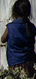

# ImageAI : Object Detection  

An <b>AI Commons</b> project <a href="https://commons.specpal.science" >https://commons.specpal.science </a>

 
<h3><b><u>TABLE OF CONTENTS</u></b></h3>
<a href="#firstdetection" >&#9635 First Object Detection</a> 
<a href="#objectextraction" >&#9635 Object Detection, Extraction and Fine-tune</a> 
<a href="#customdetection" >&#9635 Custom Object Detection</a> 
<a href="#detectionspeed" >&#9635 Detection Speed</a> 
<a href="#inputoutputtype" >&#9635 Image Input & Output Types</a> 
<a href="#documentation" >&#9635 Documentation</a> 
 
      ImageAI provides very convenient and powerful methods to perform object detection on images and extract
each object from the image. The object detection class provided only supports the current state-of-the-art RetinaNet,
while other object detection networks will be supported in the nearest future. To start performing object detection,
you must download the RetinaNet object detection via the link below:    
 <b>- <a href="https://github.com/fizyr/keras-retinanet/releases/download/0.2/resnet50_coco_best_v2.0.1.h5" style="text-decoration: none;" >RetinaNet</a></b> <b>(Size = 145 mb) </b>   
 Once you download the RetinaNet model file, you should copy the model file to the your project folder where your .py files will be.
 Then create a python file and give it a name; an example is FirstObjectDetection.py. Then write the code below into the python file:   

 <h3><b>FirstObjectDetection.py</b></h3>

<b><pre>from imageai.Detection import ObjectDetection
import os

execution_path = os.getcwd()

detector = ObjectDetection()
detector.setModelTypeAsRetinaNet()
detector.setModelPath( os.path.join(execution_path , "resnet50_coco_best_v2.0.1.h5"))
detector.loadModel()
detections = detector.detectObjectsFromImage(input_image=os.path.join(execution_path , "image2.jpg"), output_image_path=os.path.join(execution_path , "image2new.jpg"))

for eachObject in detections:
    print(eachObject["name"] + " : " + eachObject["percentage_probability"] )
    print("--------------------------------")

</pre></b>
Sample Result:
     
    

          <b>
<i>Input Image</i>
</b>
            
          <b>
<i>Output Image</i>
</b>
          
    
  
<pre>

person : 91.946941614151
--------------------------------
person : 73.61021637916565
--------------------------------
laptop : 90.24320840835571
--------------------------------
laptop : 73.6881673336029
--------------------------------
laptop : 95.16398310661316
--------------------------------
person : 87.10319399833679
--------------------------------

</pre>

 
Let us make a breakdown of the object detection code that we used above.

<b><pre>
from imageai.Detection import ObjectDetection
import os

execution_path = os.getcwd()
</pre></b>
 In the 3 lines above , we import the <b>ImageAI object detection </b> class in the first line, import the <b>os</b> in the second line and obtained
  the path to folder where our python file runs.
  <b><pre>
detector = ObjectDetection()
detector.setModelTypeAsRetinaNet()
detector.setModelPath( os.path.join(execution_path , "resnet50_coco_best_v2.0.1.h5"))
detector.loadModel()
  </pre></b>
  In the 4 lines above, we created a new instance of the <b>ObjectDetection</b> class in the first line, set the model type to RetinaNet in the second line,
  set the model path to the RetinaNet model file we downloaded and copied to the python file folder in the third line and load the model in the
   fourth line.

   <b><pre>
detections = detector.detectObjectsFromImage(input_image=os.path.join(execution_path , "image2.jpg"), output_image_path=os.path.join(execution_path , "image2new.jpg"))

for eachObject in detections:
    print(eachObject["name"] + " : " + eachObject["percentage_probability"] )
    print("--------------------------------")
</pre></b>

In the 2 lines above, we ran the <b>detectObjectsFromImage()</b> function and parse in the path to our image, and the path to the new
 image which the function will save. Then the function returns an array of dictionaries with each dictionary corresponding
 to the number of objects detected in the image. Each dictionary has the properties <b>name</b> (name of the object) and
<b>percentage_probability</b> (percentage probability of the detection)

  

<h3><b><u>Object Detection, Extraction and Fine-tune</u></b></h3>

In the examples we used above, we ran the object detection on an image and it
returned the detected objects in an array as well as save a new image with rectangular markers drawn
 on each object. In our next examples, we will be able to extract each object from the input image
  and save it independently.
   
   
  In the example code below which is very identical to the previous object detction code, we will save each object
   detected as a seperate image.

   <b><pre>from imageai.Detection import ObjectDetection
import os

execution_path = os.getcwd()

detector = ObjectDetection()
detector.setModelTypeAsRetinaNet()
detector.setModelPath( os.path.join(execution_path , "resnet50_coco_best_v2.0.1.h5"))
detector.loadModel()

detections, objects_path = detector.detectObjectsFromImage(input_image=os.path.join(execution_path , "image3.jpg"), output_image_path=os.path.join(execution_path , "image3new.jpg"), extract_detected_objects=True)

for eachObject, eachObjectPath in zip(detections, objects_path):
    print(eachObject["name"] + " : " + eachObject["percentage_probability"] )
    print("Object's image saved in " + eachObjectPath)
    print("--------------------------------")

</pre></b>

 
    
Sample Result:
     
    

          <b>
<i>Input Image</i>
</b>
            
          <b>
<i>Output Images</i>
</b>
             

              
            
<i>person</i>

          

          

              
            
<i>person</i>

          

          

              
            
<i>person</i>

          

          

              
            
<i>person</i>

          

          

              
            
<i>motorcycle</i>

          

          

              
            
<i>dog</i>

          

          

              
            
<i>car</i>

          

              
            
<i>person</i>

          

    

   

Let us review the part of the code that perform the object detection and extract the images:

<b><pre>
detections, objects_path = detector.detectObjectsFromImage(input_image=os.path.join(execution_path , "image3.jpg"), output_image_path=os.path.join(execution_path , "image3new.jpg"), extract_detected_objects=True)

for eachObject, eachObjectPath in zip(detections, objects_path):
    print(eachObject["name"] + " : " + eachObject["percentage_probability"] )
    print("Object's image saved in " + eachObjectPath)
    print("--------------------------------")
</pre></b>

In the above above lines, we called the <b>detectObjectsFromImage()</b> , parse in the input image path, output image part, and an
extra parameter <b>extract_detected_objects=True</b>. This parameter states that the function should extract each object detected from the image
and save it has a seperate image. The parameter is false by default. Once set to <b>true</b>, the function will create a directory
 which is the <b>output image path + "-objects"</b> . Then it saves all the extracted images into this new directory with
  each image's name being the <b>detected object name + "-" + a number</b> which corresponds to the order at which the objects
  were detected.
    
This new parameter we set to extract and save detected objects as an image will make the function to return 2 values. The
 first is the array of dictionaries with each dictionary corresponding to a detected object. The second is an array of the paths
  to the saved images of each object detected and extracted, and they are arranged in order at which the objects are in the
  first array.

    
  <b><h3>And one important feature you need to know!</h3></b> You will recall that the percentage probability
   for each detected object is sent back by the <b>detectObjectsFromImage()</b> function. The function has a parameter
   <b>minimum_percentage_probability</b> , whose default value is <b>50</b> (value ranges between 0 - 100) . That means the function will only return a detected
    object if it's percentage probability is <b>50 or above</b>. The value was kept at this number to ensure the integrity of the
     detection results. However, a number of objects might be skipped in the process. Therefore, you fine-tune the object
      detection by setting <b>minimum_percentage_probability</b> equal to a smaller value to detect more number of objects or higher value to detect less number of objects.

  

<h3><b><u>Custom Object Detection</u></b></h3>
The object detection model (<b>RetinaNet</b>) supported by <b>ImageAI</b> can detect 80 different types of objects. They include:  
<pre>
      person,   bicycle,   car,   motorcycle,   airplane,
          bus,   train,   truck,   boat,   traffic light,   fire hydrant,   stop_sign,
          parking meter,   bench,   bird,   cat,   dog,   horse,   sheep,   cow,   elephant,   bear,   zebra,
          giraffe,   backpack,   umbrella,   handbag,   tie,   suitcase,   frisbee,   skis,   snowboard,
          sports ball,   kite,   baseball bat,   baseball glove,   skateboard,   surfboard,   tennis racket,
          bottle,   wine glass,   cup,   fork,   knife,   spoon,   bowl,   banana,   apple,   sandwich,   orange,
          broccoli,   carrot,   hot dog,   pizza,   donot,   cake,   chair,   couch,   potted plant,   bed,
          dining table,   toilet,   tv,   laptop,   mouse,   remote,   keyboard,   cell phone,   microwave,
          oven,   toaster,   sink,   refrigerator,   book,   clock,   vase,   scissors,   teddy bear,   hair dryer,
          toothbrush.
</pre>

Interestingly, <b>ImageAI</b> allow you to perform detection for one or more of the items above. That means you can
 customize the type of object(s) you want to be detected in the image. Let's take a look at the code below:  

<b><pre>from imageai.Detection import ObjectDetection
import os

execution_path = os.getcwd()

detector = ObjectDetection()
detector.setModelTypeAsRetinaNet()
detector.setModelPath( os.path.join(execution_path , "resnet50_coco_best_v2.0.1.h5"))
detector.loadModel()

custom_objects = detector.CustomObjects(car=True, motorcycle=True)
detections = detector.detectCustomObjectsFromImage(custom_objects=custom_objects, input_image=os.path.join(execution_path , "image3.jpg"), output_image_path=os.path.join(execution_path , "image3custom.jpg"))

for eachObject in detections:
    print(eachObject["name"] + " : " + eachObject["percentage_probability"] )
    print("--------------------------------")

</pre></b>

Result:
     
    

            
    

 

Let us take a look at the part of the code that made this possible.
<pre>custom_objects = detector.CustomObjects(car=True, motorcycle=True)
detections = detector.detectCustomObjectsFromImage(custom_objects=custom_objects, input_image=os.path.join(execution_path , "image3.jpg"), output_image_path=os.path.join(execution_path , "image3custom.jpg"))

</pre>
In the above code, after loading the model (can be done before loading the model as well), we defined a new variable
"<b>custom_objects = detector.CustomObjects()</b>", in which we set its car and motorcycle properties equal to <b>True</b>.
This is to tell the model to detect only the object we set to True. Then we call the "<b>detector.detectCustomObjectsFromImage()</b>"
which is the function that allows us to perform detection of custom objects. Then we will set the "<b>custom_objects</b>" value
 to the custom objects variable we defined.
  

<h3><b><u>Detection Speed</u></b></h3>
<b> ImageAI </b> now provides detection speeds for all object detection tasks. The detection speeds allow you to reduce
 the time of detection at a rate between 20% - 80%, and yet having just slight changes but accurate detection
results. Coupled with lowering the <b>minimum_percentage_probability</b> parameter, detections can match the normal
speed and yet reduce detection time drastically. The available detection speeds are <b>"normal"</b>(default), <b>"fast"</b>, <b>"faster"</b> , <b>"fastest"</b> and <b>"flash"</b>.
All you need to do is to state the speed mode you desire when loading the model as seen below.

<b><pre>detector.loadModel(detection_speed="fast")</pre></b>  

To observe the differences in the detection speeds, look below for each speed applied to object detection with
 coupled with the adjustment of the minimum_percentage_probability , time taken to detect and detections given.
The results below are obtained from detections performed on a Windows 8 laptop with Intel Celeron N2820 CPU,
with processor speed of 2.13GHz   

<b><i>Detection Speed = "normal" , Minimum Percentage Probability = 50 (default), Detection Time = 63.5 seconds </i></b>

            

   

<b><i>Detection Speed = "fast" , Minimum Percentage Probability = 40 (default), Detection Time = 20.8 seconds </i></b>

            

   

<b><i>Detection Speed = "faster" , Minimum Percentage Probability = 30 (default), Detection Time = 11.2 seconds </i></b>

            

   

<b><i>Detection Speed = "fastest" , Minimum Percentage Probability = 30 (default), Detection Time = 7.6 seconds </i></b>

            

<b><i>Detection Speed = "flash" , Minimum Percentage Probability = 10 (default), Detection Time = 3.67 seconds </i></b>

            

 
You will notice that in the <b>"flash"</b> detection speed, the detections were most fast but least accurate.
That is because there isn't any profound object in the picture. The <b>"flash"</b> mode is most suitable
 where the input images are iconic (contain a profound image). Look at the sample below for detection in an iconic
 image.
   
<b><i>Detection Speed = "flash" , Minimum Percentage Probability = 30 (default), Detection Time = 3.85 seconds </i></b>

            

  

<h3><b><u>Image Input & Output Types</u></b></h3>
Previous version of <b>ImageAI</b> supported only file inputs and accepts file paths to an image for image detection.
Now, <b>ImageAI</b> supports 3 input types of inputs which are <b>file path to image file</b>(default), <b>numpy array of image</b> and <b>image file stream</b>
as well as 2 types of output which are image <b>file</b>(default) and numpy  <b>array </b>.
This means you can now perform object detection in production applications such as on a web server and system
 that returns file in any of the above stated formats.
  To perform object detection with numpy array or file stream input, you just need to state the input type
in the <b>.detectObjectsFromImage()</b> function or the <b>.detectCustomObjectsFromImage()</b> function. See example below.

<pre>detections = detector.detectObjectsFromImage(input_type="array", input_image=image_array , output_image_path=os.path.join(execution_path , "image.jpg")) # For numpy array input type
detections = detector.detectObjectsFromImage(input_type="stream", input_image=image_stream , output_image_path=os.path.join(execution_path , "test2new.jpg")) # For file stream input type</pre>  To perform object detection with numpy array output you just need to state the output type
in the <b>.detectObjectsFromImage()</b> function or the <b>.detectCustomObjectsFromImage()</b> function. See example below.

<pre>detected_image_array, detections = detector.detectObjectsFromImage(output_type="array", input_image="image.jpg" ) # For numpy array output type
</pre>

  

<h3><b><u>Documentation</u></b></h3>

<b>imageai.Detection.ObjectDetection </b> class 

          The <b>ObjectDetection</b> class can be used to perform object detection on images, object
            extraction and more by instantiating it and calling the available functions below:  
            <b>- setModelTypeAsRetinaNet()</b>    This function should be called
            to use the RetinaNet model file for object detection. You only need to call it once.  
            <b>- setModelPath()</b>    You need to call this function only once and parse the path to
       the model file path into it. The model file type must correspond to the model type you set.   
             <b>- loadModel()</b>      This function is required and is used to load the model structure into the program from the file path defined  
                in the setModelPath() function. This function receives an optional value which is "detection_speed".  
                The value is used to reduce the time it takes to detect objects in an image, down to about a 10% of the normal time, with  
                 with just slight reduction in the number of objects detected.     ***** prediction_speed (optional); Acceptable values are "normal", "fast", "faster", "fastest" and "flash"    :param detection_speed:  
                :return:     
        <b>- detectObjectsFromImage()</b> This   function is used to detect objects observable in the given image path:  
                    ****** input_image , which can be file to path, image numpy array or image file stream  
                    ****** output_image_path (only if output_type = file) , file path to the output image that will contain the detection boxes and label, if output_type="file"  
                    ****** input_type (optional) , file path/numpy array/image file stream of the image. Acceptable values are "file", "array" and "stream"  
                    ****** output_type (optional) , file path/numpy array/image file stream of the image. Acceptable values are "file" and "array"  
                    ****** extract_detected_objects (optional) , option to save each object detected individually as an image and return an array of the objects' image path.  
                    ****** minimum_percentage_probability (optional, 50 by default) , option to set the minimum percentage probability for nominating a detected object for output.     The values returned by this function depends on the parameters parsed. The possible values returnable
            are stated as below  
            - If extract_detected_objects = False or at its default value and output_type = 'file' or  
                at its default value, you must parse in the 'output_image_path' as a string to the path you want  
                the detected image to be saved. Then the function will return:  
                1. an array of dictionaries, with each dictionary corresponding to the objects  
                    detected in the image. Each dictionary contains the following property:  
                    * name  
                    * percentage_probability    - If extract_detected_objects = False or at its default value and output_type = 'array' ,
              Then the function will return:  1. a numpy array of the detected image  
                2. an array of dictionaries, with each dictionary corresponding to the objects  
                    detected in the image. Each dictionary contains the following property:  
                    * name  
                    * percentage_probability    - If extract_detected_objects = True and output_type = 'file' or  
                at its default value, you must parse in the 'output_image_path' as a string to the path you want  
                the detected image to be saved. Then the function will return:  
                1. an array of dictionaries, with each dictionary corresponding to the objects  
                    detected in the image. Each dictionary contains the following property:  
                    * name   
                    * percentage_probability  
                2. an array of string paths to the image of each object extracted from the image    - If extract_detected_objects = True and output_type = 'array', the the function will return:  
                1. a numpy array of the detected image  
                2. an array of dictionaries, with each dictionary corresponding to the objects  
                    detected in the image. Each dictionary contains the following property:  
                    * name  
                    * percentage_probability  
                3. an array of numpy arrays of each object detected in the image    
      :param input_image:  
            :param output_image_path:  
            :param input_type:  
            :param output_type:  
            :param extract_detected_objects:  
            :param minimum_percentage_probability:  
            :return output_objects_array:  
            :return detected_copy:  
            :return detected_detected_objects_image_array:      
    <b>- CustomObjecs()</b>  This function can be optionally called to handpick the type of objects you want to detect  
                         from an image. The objects are pre-initiated in the function variables and predefined as 'False',  
                         which you can easily set to true for any number of objects available.  This function  
                         returns a dictionary which must be parsed into the 'detectCustomObjectsFromImage()'. Detecting  
                          custom objects only happens when you call the function 'detectCustomObjectsFromImage()'    ****** true_values_of_objects (array); Acceptable values are 'True' and False  for all object values present    :param boolean_values:  
                        :return: custom_objects_dict  
        <b>- detectCustomObjectsFromImage()</b> This function is used to detect predefined objects observable in the given image path:  
                            * custom_objects , an instance of the CustomObject class to filter which objects to detect  
                            * input_image , which can be file to path, image numpy array or image file stream  
                            * output_image_path , file path to the output image that will contain the detection boxes and label, if output_type="file"  
                            * input_type (optional) , file path/numpy array/image file stream of the image. Acceptable values are "file", "array" and "stream"  
                            * output_type (optional) , file path/numpy array/image file stream of the image. Acceptable values are "file" and "array"  
                            * extract_detected_objects (optional, False by default) , option to save each object detected individually as an image and return an array of the objects' image path.  
                            * minimum_percentage_probability (optional, 50 by default) , option to set the minimum percentage probability for nominating a detected object for output.     The values returned by this function depends on the parameters parsed. The possible values returnable
            are stated as below  
            - If extract_detected_objects = False or at its default value and output_type = 'file' or  
                at its default value, you must parse in the 'output_image_path' as a string to the path you want  
                the detected image to be saved. Then the function will return:  
                1. an array of dictionaries, with each dictionary corresponding to the objects  
                    detected in the image. Each dictionary contains the following property:  
                    * name  
                    * percentage_probability    - If extract_detected_objects = False or at its default value and output_type = 'array' ,
              Then the function will return:  1. a numpy array of the detected image  
                2. an array of dictionaries, with each dictionary corresponding to the objects  
                    detected in the image. Each dictionary contains the following property:  
                    * name  
                    * percentage_probability    - If extract_detected_objects = True and output_type = 'file' or   
                at its default value, you must parse in the 'output_image_path' as a string to the path you want  
                the detected image to be saved. Then the function will return:  
                1. an array of dictionaries, with each dictionary corresponding to the objects  
                    detected in the image. Each dictionary contains the following property:  
                    * name  
                    * percentage_probability  
                2. an array of string paths to the image of each object extracted from the image    - If extract_detected_objects = True and output_type = 'array', the the function will return:  
                1. a numpy array of the detected image  
                2. an array of dictionaries, with each dictionary corresponding to the objects  
                    detected in the image. Each dictionary contains the following property:  
                    * name  
                    * percentage_probability  
                3. an array of numpy arrays of each object detected in the image    :param input_image:  
            :param output_image_path:  
            :param input_type:  
            :param output_type:  
            :param extract_detected_objects:   
            :param minimum_percentage_probability:  
            :return output_objects_array:  
            :return detected_copy:  
            :return detected_detected_objects_image_array:  

