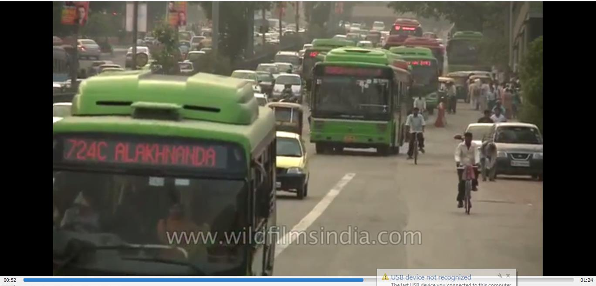

# ImageAI : Video Object Detection, Tracking  and Analysis

A **DeepQuest AI** project [https://deepquestai.com](https://deepquestai.com)

---

## TABLE OF CONTENTS

- <a href="#videodetection" > :white_square_button: First Video Object Detection</a>
- <a href="#customvideodetection" > :white_square_button: Custom Video Object Detection (Object Tracking)</a>
- <a href="#camerainputs" > :white_square_button: Camera / Live Stream Video Detection</a>
- <a href="#videoanalysis" > :white_square_button: Video Analysis</a>
- <a href="#videodetectionspeed" > :white_square_button: Detection Speed</a>
- <a href="#hidingdetails" > :white_square_button: Hiding/Showing Object Name and Probability</a>
- <a href="#videodetectionintervals" > :white_square_button: Frame Detection Intervals</a>
- <a href="#detectiontimeout" > :white_square_button: Video Detection Timeout (NEW)</a>
- <a href="#documentation" > :white_square_button: Documentation</a>

ImageAI provides convenient, flexible and powerful methods to perform object detection on videos. The video object detection class provided only supports RetinaNet, YOLOv3 and TinyYOLOv3. This version of **ImageAI** provides commercial grade video objects detection features, which include but not limited to device/IP camera inputs, per frame, per second, per minute and entire video analysis for storing in databases and/or real-time visualizations and for future insights.

To start performing video object detection, you must download the RetinaNet, YOLOv3 or TinyYOLOv3 object detection model via the links below:

- **[RetinaNet](https://github.com/OlafenwaMoses/ImageAI/releases/download/1.0/resnet50_coco_best_v2.0.1.h5)** _(Size = 145 mb, high performance and accuracy, with longer detection time)_
- **[YOLOv3](https://github.com/OlafenwaMoses/ImageAI/releases/download/1.0/yolo.h5)** _(Size = 237 mb, moderate performance and accuracy, with a moderate detection time)_
- **[TinyYOLOv3](https://github.com/OlafenwaMoses/ImageAI/releases/download/1.0/yolo-tiny.h5)** _(Size = 34 mb, optimized for speed and moderate performance, with fast detection time)_

Because video object detection is a compute intensive tasks, we advise you perform this experiment using a computer with a NVIDIA GPU and the GPU version of Tensorflow installed. Performing Video Object Detection CPU will be slower than using an NVIDIA GPU powered computer. You can use Google Colab for this experiment as it has an NVIDIA K80 GPU available for free.

 Once you download the object detection model file, you should copy the model file to the your project folder where your .py files will be.
 Then create a python file and give it a name; an example is `FirstVideoObjectDetection.py`. Then write the code below into the python file:


### FirstVideoObjectDetection.py
<div id="videodetection" ></div>

```python
from imageai.Detection import VideoObjectDetection
import os

execution_path = os.getcwd()

detector = VideoObjectDetection()
detector.setModelTypeAsRetinaNet()
detector.setModelPath( os.path.join(execution_path , "resnet50_coco_best_v2.0.1.h5"))
detector.loadModel()

video_path = detector.detectObjectsFromVideo(input_file_path=os.path.join(execution_path, "traffic.mp4"),
                                output_file_path=os.path.join(execution_path, "traffic_detected")
                                , frames_per_second=20, log_progress=True)
print(video_path)
```


Input Video (a 1min 24seconds video)

[](https://github.com/OlafenwaMoses/ImageAI/blob/master/data-videos/traffic.mp4)

Output Video
[](https://www.youtube.com/embed/qplVDqOmElI?rel=0)

Let us make a breakdown of the object detection code that we used above.

```python
from imageai.Detection import VideoObjectDetection
import os

execution_path = os.getcwd()
```

 In the 3 lines above , we import the **ImageAI video object detection ** class in the first line, import the **os** in the second line and obtained
  the path to folder where our python file runs.

```python
detector = VideoObjectDetection()
detector.setModelTypeAsRetinaNet()
detector.setModelPath( os.path.join(execution_path , "resnet50_coco_best_v2.0.1.h5"))
detector.loadModel()
```

In the 4 lines above, we created a new instance of the **VideoObjectDetection** class in the first line, set the model type to RetinaNet in the second line, set the model path to the RetinaNet model file we downloaded and copied to the python file folder in the third line and load the model in the fourth line.

```python
video_path = detector.detectObjectsFromVideo(input_file_path=os.path.join(execution_path, "traffic.mp4"),
                                 output_file_path=os.path.join(execution_path, "traffic_detected"),
                                 frames_per_second=20, log_progress=True)
print(video_path)
```

In the 2 lines above, we ran the `detectObjectsFromVideo()` function and parse in the path to our video,the path to the new video (without the extension, it saves a .avi video by default) which the function will save, the number of frames per second (fps) that you we desire the output video to have and option to log the progress of the detection in the console. Then the function returns a the path to the saved video which contains boxes and percentage probabilities rendered on objects detected in the video.


### Custom Video Object Detection
<div id="customvideodetection" ></div>

The video object detection model (**RetinaNet**) supported by **ImageAI** can detect 80 different types of objects. They include: 
```
      person, bicycle, car, motorcycle, airplane, bus, train, truck, boat, traffic light, fire hydrant, stop_sign,
      parking meter,   bench,   bird,   cat,   dog,   horse,   sheep,   cow,   elephant,   bear,   zebra,
      giraffe,   backpack,   umbrella,   handbag,   tie,   suitcase,   frisbee,   skis,   snowboard,
      sports ball,   kite,   baseball bat,   baseball glove,   skateboard,   surfboard,   tennis racket,
      bottle,   wine glass,   cup,   fork,   knife,   spoon,   bowl,   banana,   apple,   sandwich,   orange,
      broccoli,   carrot,   hot dog,   pizza,   donot,   cake,   chair,   couch,   potted plant,   bed,
      dining table,   toilet,   tv,   laptop,   mouse,   remote,   keyboard,   cell phone,   microwave,
      oven,   toaster,   sink,   refrigerator,   book,   clock,   vase,   scissors,   teddy bear,   hair dryer,
      toothbrush.
```


Interestingly, **ImageAI** allow you to perform  detection for one or more of the items above. That means you can customize the type of object(s) you want to be detected in the video. Let's take a look at the code below:

```python
from imageai.Detection import VideoObjectDetection
import os

execution_path = os.getcwd()

detector = VideoObjectDetection()
detector.setModelTypeAsRetinaNet()
detector.setModelPath( os.path.join(execution_path , "resnet50_coco_best_v2.0.1.h5"))
detector.loadModel()

custom_objects = detector.CustomObjects(person=True, bicycle=True, motorcycle=True)

video_path = detector.detectCustomObjectsFromVideo(
                custom_objects=custom_objects,
                input_file_path=os.path.join(execution_path, "traffic.mp4"),
                output_file_path=os.path.join(execution_path, "traffic_custom_detected"),
                frames_per_second=20, log_progress=True)
print(video_path)
```

Let us take a look at the part of the code that made this possible.

```python
custom_objects = detector.CustomObjects(person=True, bicycle=True, motorcycle=True)

video_path = detector.detectCustomObjectsFromVideo(
                custom_objects=custom_objects, 
                input_file_path=os.path.join(execution_path, "traffic.mp4"),
                output_file_path=os.path.join(execution_path, "traffic_custom_detected"),
                frames_per_second=20, log_progress=True)
```

In the above code, after loading the model (can be done before loading the model as well), we defined a new variable
`custom_objects = detector.CustomObjects()`, in which we set its person, car and motorcycle properties equal to **True**.
This is to tell the model to detect only the object we set to True. Then we call the `detector.detectCustomObjectsFromVideo()`
which is the function that allows us to perform detection of custom objects. Then we will set the `custom_objects` value
 to the custom objects variable we defined.

Output Video
[](https://www.youtube.com/embed/YfAycAzkwPM?rel=0)
C:\Users\User\PycharmProjects\ImageAITest\traffic_custom_detected.avi


### Camera / Live Stream Video Detection
<div id="camerainputs"></div>

**ImageAI** now allows live-video detection with support for camera inputs. Using **OpenCV**'s `VideoCapture()` function, you can load live-video streams from a device camera, cameras connected by cable or IP cameras, and parse it into **ImageAI**'s `detectObjectsFromVideo()` and `detectCustomObjectsFromVideo()` functions. All features that are supported for detecting objects in a video file is also available for detecting objects in a camera's live-video feed. Find below an example of detecting live-video feed from the device camera.

```python
from imageai.Detection import VideoObjectDetection
import os
import cv2

execution_path = os.getcwd()


camera = cv2.VideoCapture(0)

detector = VideoObjectDetection()
detector.setModelTypeAsRetinaNet()
detector.setModelPath(os.path.join(execution_path , "resnet50_coco_best_v2.0.1.h5"))
detector.loadModel()


video_path = detector.detectObjectsFromVideo(
                camera_input=camera,
                output_file_path=os.path.join(execution_path, "camera_detected_video"),
                frames_per_second=20, log_progress=True, minimum_percentage_probability=40)
```

The difference in the code above and the code for the detection of a video file is that we defined an **OpenCV VideoCapture** instance and loaded the default device camera into it. Then we parsed the camera we defined into the parameter `camera_input` which replaces the `input_file_path` that is used for video file.

### Video Analysis
<div id="videoanalysis"></div>

**ImageAI** now provide commercial-grade video analysis in the Video Object Detection class, for both video file inputs and camera inputs. This feature allows developers to obtain deep insights into any video processed with **ImageAI**. This insights can be visualized in real-time, stored in a NoSQL database for future review or analysis.

For video analysis, the `detectObjectsFromVideo()` and `detectCustomObjectsFromVideo()` now allows you to state your own defined functions which will be executed for every frame, seconds and/or minute of the video detected as well as a state a function that will be executed at the end of a video detection. Once this functions are stated, they will receive raw but comprehensive analytical data on the index of the frame/second/minute, objects detected (name, percentage_probability and box_points), number of instances of each unique object detected and average number of occurrence of each unique object detected over a second/minute and entire video.

To obtain the video analysis, all you need to do is specify a function, state the corresponding parameters it will be receiving and parse the function name into the `per_frame_function`, `per_second_function`, `per_minute_function` and `video_complete_function` parameters in the detection function. Find below examples of video analysis functions.

```python
def forFrame(frame_number, output_array, output_count):
    print("FOR FRAME " , frame_number)
    print("Output for each object : ", output_array)
    print("Output count for unique objects : ", output_count)
    print("------------END OF A FRAME --------------")

def forSeconds(second_number, output_arrays, count_arrays, average_output_count):
    print("SECOND : ", second_number)
    print("Array for the outputs of each frame ", output_arrays)
    print("Array for output count for unique objects in each frame : ", count_arrays)
    print("Output average count for unique objects in the last second: ", average_output_count)
    print("------------END OF A SECOND --------------")

def forMinute(minute_number, output_arrays, count_arrays, average_output_count):
    print("MINUTE : ", minute_number)
    print("Array for the outputs of each frame ", output_arrays)
    print("Array for output count for unique objects in each frame : ", count_arrays)
    print("Output average count for unique objects in the last minute: ", average_output_count)
    print("------------END OF A MINUTE --------------")

video_detector = VideoObjectDetection()
video_detector.setModelTypeAsYOLOv3()
video_detector.setModelPath(os.path.join(execution_path, "yolo.h5"))
video_detector.loadModel()

video_detector.detectObjectsFromVideo(
    input_file_path=os.path.join(execution_path, "traffic.mp4"),
    output_file_path=os.path.join(execution_path, "traffic_detected"),
    frames_per_second=10,
    per_second_function=forSeconds,
    per_frame_function=forFrame,
    per_minute_function=forMinute,
    minimum_percentage_probability=30
)
```

When the detection starts on a video feed, be it from a video file or camera input, the result will have the format as below:

**Results for the Frame function**
```
FOR FRAME : 1
 
Output for each object : [{'box_points': (362, 295, 443, 355), 'name': 'boat', 'percentage_probability': 26.666194200515747}, {'box_points': (319, 245, 386, 296), 'name': 'boat', 'percentage_probability': 30.052968859672546}, {'box_points': (219, 308, 341, 358), 'name': 'boat', 'percentage_probability': 47.46982455253601}, {'box_points': (589, 198, 621, 241), 'name': 'bus', 'percentage_probability': 24.62330162525177}, {'box_points': (519, 181, 583, 263), 'name': 'bus', 'percentage_probability': 27.446213364601135}, {'box_points': (493, 197, 561, 272), 'name': 'bus', 'percentage_probability': 59.81815457344055}, {'box_points': (432, 187, 491, 240), 'name': 'bus', 'percentage_probability': 64.42965269088745}, {'box_points': (157, 225, 220, 255), 'name': 'car', 'percentage_probability': 21.150341629981995}, {'box_points': (324, 249, 377, 293), 'name': 'car', 'percentage_probability': 24.089913070201874}, {'box_points': (152, 275, 260, 327), 'name': 'car', 'percentage_probability': 30.341443419456482}, {'box_points': (433, 198, 485, 244), 'name': 'car', 'percentage_probability': 37.205660343170166}, {'box_points': (184, 226, 233, 260), 'name': 'car', 'percentage_probability': 38.52525353431702}, {'box_points': (3, 296, 134, 359), 'name': 'car', 'percentage_probability': 47.80363142490387}, {'box_points': (357, 302, 439, 359), 'name': 'car', 'percentage_probability': 47.94844686985016}, {'box_points': (481, 266, 546, 314), 'name': 'car', 'percentage_probability': 65.8585786819458}, {'box_points': (597, 269, 624, 318), 'name': 'person', 'percentage_probability': 27.125394344329834}]
 
Output count for unique objects : {'bus': 4, 'boat': 3, 'person': 1, 'car': 8}

------------END OF A FRAME --------------
```

For any function you parse into the **per_frame_function**, the function will be executed after every single video frame is processed and he following will be parsed into it:

* **Frame Index:** This is the position number of the frame inside the video (e.g 1 for first frame and 20 for twentieth frame).
* **Output Array:** This is an array of dictionaries. Each dictionary corresponds to each detected object in the image and it contains the "name", "percentage_probabaility" and "box_points"(x1,y1,x2,y2) values of the object.
* **Output Count:** This is a dictionary that has the name of each unique object detected as its keys and the number of instances of the objects detected as the values.

**Results for the Second function**
```
FOR SECOND : 1
 
 Array for the outputs of each frame [[{'box_points': (362, 295, 443, 355), 'name': 'boat', 'percentage_probability': 26.666194200515747}, {'box_points': (319, 245, 386, 296), 'name': 'boat', 'percentage_probability': 30.052968859672546}, {'box_points': (219, 308, 341, 358), 'name': 'boat', 'percentage_probability': 47.46982455253601}, {'box_points': (589, 198, 621, 241), 'name': 'bus', 'percentage_probability': 24.62330162525177}, {'box_points': (519, 181, 583, 263), 'name': 'bus', 'percentage_probability': 27.446213364601135}, {'box_points': (493, 197, 561, 272), 'name': 'bus', 'percentage_probability': 59.81815457344055}, {'box_points': (432, 187, 491, 240), 'name': 'bus', 'percentage_probability': 64.42965269088745}, {'box_points': (157, 225, 220, 255), 'name': 'car', 'percentage_probability': 21.150341629981995}, {'box_points': (324, 249, 377, 293), 'name': 'car', 'percentage_probability': 24.089913070201874}, {'box_points': (152, 275, 260, 327), 'name': 'car', 'percentage_probability': 30.341443419456482}, {'box_points': (433, 198, 485, 244), 'name': 'car', 'percentage_probability': 37.205660343170166}, {'box_points': (184, 226, 233, 260), 'name': 'car', 'percentage_probability': 38.52525353431702}, {'box_points': (3, 296, 134, 359), 'name': 'car', 'percentage_probability': 47.80363142490387}, {'box_points': (357, 302, 439, 359), 'name': 'car', 'percentage_probability': 47.94844686985016}, {'box_points': (481, 266, 546, 314), 'name': 'car', 'percentage_probability': 65.8585786819458}, {'box_points': (597, 269, 624, 318), 'name': 'person', 'percentage_probability': 27.125394344329834}],
 [{'box_points': (316, 240, 384, 302), 'name': 'boat', 'percentage_probability': 29.594269394874573}, {'box_points': (361, 295, 441, 354), 'name': 'boat', 'percentage_probability': 36.11513376235962}, {'box_points': (216, 305, 340, 357), 'name': 'boat', 'percentage_probability': 44.89373862743378}, {'box_points': (432, 198, 488, 244), 'name': 'truck', 'percentage_probability': 22.914741933345795}, {'box_points': (589, 199, 623, 240), 'name': 'bus', 'percentage_probability': 20.545457303524017}, {'box_points': (519, 182, 583, 263), 'name': 'bus', 'percentage_probability': 24.467085301876068}, {'box_points': (492, 197, 563, 271), 'name': 'bus', 'percentage_probability': 61.112016439437866}, {'box_points': (433, 188, 490, 241), 'name': 'bus', 'percentage_probability': 65.08989334106445}, {'box_points': (352, 303, 442, 357), 'name': 'car', 'percentage_probability': 20.025095343589783}, {'box_points': (136, 172, 188, 195), 'name': 'car', 'percentage_probability': 21.571354568004608}, {'box_points': (152, 276, 261, 326), 'name': 'car', 'percentage_probability': 33.07966589927673}, {'box_points': (181, 225, 230, 256), 'name': 'car', 'percentage_probability': 35.111838579177856}, {'box_points': (432, 198, 488, 244), 'name': 'car', 'percentage_probability': 36.25282347202301}, {'box_points': (3, 292, 130, 360), 'name': 'car', 'percentage_probability': 67.55480170249939}, {'box_points': (479, 265, 546, 314), 'name': 'car', 'percentage_probability': 71.47912979125977}, {'box_points': (597, 269, 625, 318), 'name': 'person', 'percentage_probability': 25.903674960136414}],................, 
[{'box_points': (133, 250, 187, 278), 'name': 'umbrella', 'percentage_probability': 21.518094837665558}, {'box_points': (154, 233, 218, 259), 'name': 'umbrella', 'percentage_probability': 23.687003552913666}, {'box_points': (348, 311, 425, 360), 'name': 'boat', 'percentage_probability': 21.015766263008118}, {'box_points': (11, 164, 137, 225), 'name': 'bus', 'percentage_probability': 32.20453858375549}, {'box_points': (424, 187, 485, 243), 'name': 'bus', 'percentage_probability': 38.043853640556335}, {'box_points': (496, 186, 570, 264), 'name': 'bus', 'percentage_probability': 63.83994221687317}, {'box_points': (588, 197, 622, 240), 'name': 'car', 'percentage_probability': 23.51653128862381}, {'box_points': (58, 268, 111, 303), 'name': 'car', 'percentage_probability': 24.538707733154297}, {'box_points': (2, 246, 72, 301), 'name': 'car', 'percentage_probability': 28.433072566986084}, {'box_points': (472, 273, 539, 323), 'name': 'car', 'percentage_probability': 87.17672824859619}, {'box_points': (597, 270, 626, 317), 'name': 'person', 'percentage_probability': 27.459821105003357}]
 ]
 
Array for output count for unique objects in each frame : [{'bus': 4, 'boat': 3, 'person': 1, 'car': 8},
 {'truck': 1, 'bus': 4, 'boat': 3, 'person': 1, 'car': 7},
 {'bus': 5, 'boat': 2, 'person': 1, 'car': 5},
 {'bus': 5, 'boat': 1, 'person': 1, 'car': 9},
 {'truck': 1, 'bus': 2, 'car': 6, 'person': 1},
 {'truck': 2, 'bus': 4, 'boat': 2, 'person': 1, 'car': 7},
 {'truck': 1, 'bus': 3, 'car': 7, 'person': 1, 'umbrella': 1},
 {'bus': 4, 'car': 7, 'person': 1, 'umbrella': 2},
 {'bus': 3, 'car': 6, 'boat': 1, 'person': 1, 'umbrella': 3},
 {'bus': 3, 'car': 4, 'boat': 1, 'person': 1, 'umbrella': 2}]
 
Output average count for unique objects in the last second: {'truck': 0.5, 'bus': 3.7, 'umbrella': 0.8, 'boat': 1.3, 'person': 1.0, 'car': 6.6}

------------END OF A SECOND --------------
```

In the above result, the video was processed and saved in 10 frames per second (FPS). For any function you parse into the **per_second_function**, the function will be executed after every single second of the video that is processed and he following will be parsed into it:

- **Second Index:** This is the position number of the second inside the video (e.g 1 for first second and 20 for twentieth second).
- **Output Array:** This is an array of arrays, with each contained array and its position (array index + 1) corresponding to the equivalent frame in the last second of the video (In the above example, their are 10 arrays which corresponds to the 10 frames contained in one second). Each contained array contains dictionaries. Each dictionary corresponds to each detected object in the image and it contains the "name", "percentage_probabaility" and "box_points"(x1,y1,x2,y2) values of the object.
- **Count arrays:** This is an array of dictionaries. Each dictionary and its position (array index + 1)  corresponds to the equivalent frame in the last second of he video.  Each dictionary has the name of each unique object detected as its keys and the number of instances of the objects detected as the values.
- **Average Output Count:** This is a dictionary that has the name of each unique object detected in the last second as its keys and the average number of instances of the objects detected across the number of frames as the values.

**Results for the Minute function**
The above set of **4 parameters** that are returned for every second of the video processed is the same parameters to that will be returned for every minute of the video processed. The difference is that the index returned corresponds to the minute index, the **output_arrays** is an array that contains the number of FPS * 60  number of arrays (in the code example above, 10 frames per second(fps) * 60 seconds = 600 frames = 600 arrays), and the **count_arrays** is an array that contains the number of FPS * 60  number of dictionaries (in the code example above, 10 frames per second(fps) * 60 seconds = 600 frames = 600 dictionaries) and the **average_output_count** is a dictionary that covers all the objects detected in all the frames contained in the last minute.

**Results for the Video Complete Function**
**ImageAI** allows you to obtain complete analysis of the entire video processed. All you need is to define a function like the forSecond or forMinute function and set the **video_complete_function** parameter into your `.detectObjectsFromVideo()` or `.detectCustomObjectsFromVideo()` function. The same values for the per_second-function and per_minute_function will be returned. The difference is that no index will be returned and the other 3 values will be returned, and the 3 values will cover all frames in the video. Below is a sample function: 

```python
def forFull(output_arrays, count_arrays, average_output_count):
    #Perform action on the 3 parameters returned into the function

video_detector.detectObjectsFromVideo(
    input_file_path=os.path.join(execution_path, "traffic.mp4"),
    output_file_path=os.path.join(execution_path, "traffic_detected"),
    frames_per_second=10,
    video_complete_function=forFull,
    minimum_percentage_probability=30
)
```

**FINAL NOTE ON VIDEO ANALYSIS** : **ImageAI** allows you to obtain the detected video frame as a Numpy array at each frame, second and minute function. All you need to do is specify one more parameter in your function and set `return_detected_frame=True` in your `detectObjectsFromVideo()` or `detectCustomObjectsFrom()` function. Once this is set, the extra parameter you sepecified in your function will be the Numpy array of the detected frame. See a sample below:

```python
def forFrame(frame_number, output_array, output_count, detected_frame):
    print("FOR FRAME " , frame_number)
    print("Output for each object : ", output_array)
    print("Output count for unique objects : ", output_count)
	print("Returned Objects is : ", type(detected_frame))
    print("------------END OF A FRAME --------------")

video_detector.detectObjectsFromVideo(
    input_file_path=os.path.join(execution_path, "traffic.mp4"),
    output_file_path=os.path.join(execution_path, "traffic_detected"),
    frames_per_second=10,
    per_frame_function=forFrame,
    minimum_percentage_probability=30,
    return_detected_frame=True
)
```

### Video Detection Speed
<div id="videodetectionspeed"></div>

**ImageAI** now provides detection speeds for all video object detection tasks. The detection speeds allow you to reduce
 the time of detection at a rate between 20% - 80%, and yet having just slight changes but accurate detection
results. Coupled with lowering the **minimum_percentage_probability** parameter, detections can closely match the normal
speed and yet reduce detection time drastically. The available detection speeds are **"normal"**(default), **"fast"**, **"faster"** , **"fastest"** and **"flash"**.
All you need to do is to state the speed mode you desire when loading the model as seen below.

```python
detector.loadModel(detection_speed="fast")
```

To observe the differences in the detection speeds, look below for each speed applied to object detection with
 coupled with the adjustment of the minimum_percentage_probability , time taken to detect and detections given.
The results below are obtained from detections performed on a NVIDIA K80 GPU. Links are provided below to download
 the videos for each detection speed applied.

Video Length = 1min 24seconds, Detection Speed = "normal" , Minimum Percentage Probability = 50 (default), Detection Time = 29min 3seconds
[](https://www.youtube.com/embed/qplVDqOmElI?rel=0)


**Video Length = 1min 24seconds, Detection Speed = "fast" , Minimum Percentage Probability = 40, Detection Time = 11min 6seconds**
<a href="https://drive.google.com/open?id=118m6UnEG7aFdzxO7uhO_6C-981LJ3Gpf" ><button style="font-size: 12px; color: white; background-color: blue; height: 20px " > >>> Download detected video at speed "fast" </button></a>

**Video Length = 1min 24seconds, Detection Speed = "faster" , Minimum Percentage Probability = 30, Detection Time = 7min 47seconds**
<a href="https://drive.google.com/open?id=1s1FQWFsEX1Yf4FvUPVleK7vRxaQ6pgUy" ><button style="font-size: 12px; color: white; background-color: blue; height: 20px " > >>> Download detected video at speed "faster" </button></a>

**Video Length = 1min 24seconds, Detection Speed = "fastest" , Minimum Percentage Probability = 20, Detection Time = 6min 20seconds**
<a href="https://drive.google.com/open?id=1Wlt0DTGxl-JX7otd30MH4qhURv0rG9rw" ><button style="font-size: 12px; color: white; background-color: blue; height: 20px " > >>> Download detected video at speed "fastest" </button></a>

**Video Length = 1min 24seconds, Detection Speed = "flash" , Minimum Percentage Probability = 10, Detection Time = 3min 55seconds**
<a href="https://drive.google.com/open?id=1V3irCpP49bEUtpjG7Vuk6vEQQAZI-4PI" ><button style="font-size: 12px; color: white; background-color: blue; height: 20px " > >>> Download detected video at speed "flash" </button></a>

If you use more powerful NVIDIA GPUs, you will definitely have faster detection time than stated above.

### Frame Detection Intervals
<div id="videodetectionintervals" ></div>

The above video objects detection task are optimized for frame-real-time object detections that ensures that objects in every frame of the video is detected. **ImageAI** provides you the option to adjust the video frame detections which can speed up your video detection process. When calling the `.detectObjectsFromVideo()` or `.detectCustomObjectsFromVideo()`, you can specify at which frame interval detections should be made. By setting the **frame_detection_interval** parameter to be  equal to 5 or 20, that means the object detections in the video will be updated after 5 frames or 20 frames.
If your output video **frames_per_second** is set to 20, that means the object detections in the video will be updated once in every quarter of a second or every second. This is useful in case scenarious where the available compute is less powerful and speeds of moving objects are low. This ensures you can have objects detected as second-real-time , half-a-second-real-time or whichever way suits your needs. We conducted video object detection on the same input video we have been using all this while by applying a **frame_detection_interval** value equal to 5.
The results below are obtained from detections performed on a NVIDIA K80 GPU.
See the results and link to download the videos below:


**Video Length = 1min 24seconds, Detection Speed = "normal" , Minimum Percentage Probability = 50 (default), Frame Detection Interval = 5, Detection Time = 15min 49seconds**

<a href="https://drive.google.com/open?id=10m6kXlXWGOGc-IPw6TsKxBi-SXXOH9xK" ><button style="font-size: 12px; color: white; background-color: blue; height: 20px " > >>> Download detected video at speed "normal" and interval=5 </button></a>


**Video Length = 1min 24seconds, Detection Speed = "fast" , Minimum Percentage Probability = 40, Frame Detection Interval = 5, Detection Time = 5min 6seconds**

<a href="https://drive.google.com/open?id=17934YONVSXvd4uuJE0KwenEFks7fFYe4" ><button style="font-size: 12px; color: white; background-color: blue; height: 20px " > >>> Download detected video at speed "fast" and interval=5 </button></a>


**Video Length = 1min 24seconds, Detection Speed = "faster" , Minimum Percentage Probability = 30, Frame Detection Interval = 5, Detection Time = 3min 18seconds**

<a href="https://drive.google.com/open?id=1cs_06CuhXDvZp3fHJWFpam-31eclOhc-" ><button style="font-size: 12px; color: white; background-color: blue; height: 20px " > >>> Download detected video at speed "faster" and interval=5 </button></a>


**Video Length = 1min 24seconds, Detection Speed = "fastest" , Minimum Percentage Probability = 20 , Frame Detection Interval = 5, Detection Time = 2min 18seconds**
[](https://www.youtube.com/embed/S-jgBTQgbd4?rel=0)


**Video Length = 1min 24seconds, Detection Speed = "flash" , Minimum Percentage Probability = 10, Frame Detection Interval = 5, Detection Time = 1min 27seconds**

[Download detected video at speed "flash" and interval=5](https://drive.google.com/open?id=1aN2nnVoFjhUWpcz2Und3dsCT9OKrakM0)


###Video Detection Timeout
<div id="detectiontimeout"></div>

**ImageAI** now allows you to set a timeout in seconds for detection of objects in videos or camera live feed.
To set a timeout for your video detection code, all you need to do is specify the `detection_timeout` parameter in the `detectObjectsFromVideo()` function to the number of desired seconds. In the example code below, we set `detection_timeout` to 120 seconds (2 minutes). 

```python
from imageai.Detection import VideoObjectDetection
import os
import cv2

execution_path = os.getcwd()
camera = cv2.VideoCapture(0)

detector = VideoObjectDetection()
detector.setModelTypeAsRetinaNet()
detector.setModelPath(os.path.join(execution_path , "resnet50_coco_best_v2.0.1.h5"))
detector.loadModel()


video_path = detector.detectObjectsFromVideo(camera_input=camera,
                                             output_file_path=os.path.join(execution_path, "camera_detected_video"),
                                             frames_per_second=20,
                                             log_progress=True,
                                             minimum_percentage_probability=40,
                                             detection_timeout=120)
```


### Documentation
<div id="documentation" ></div>

We have provided full documentation for all **ImageAI** classes and functions in 3 major languages. Find links below: 

- Documentation - **English Version  [https://imageai.readthedocs.io](https://imageai.readthedocs.io)**
- Documentation - **Chinese Version  [https://imageai-cn.readthedocs.io](https://imageai-cn.readthedocs.io)**
- Documentation - **French Version  [https://imageai-fr.readthedocs.io](https://imageai-fr.readthedocs.io)**

