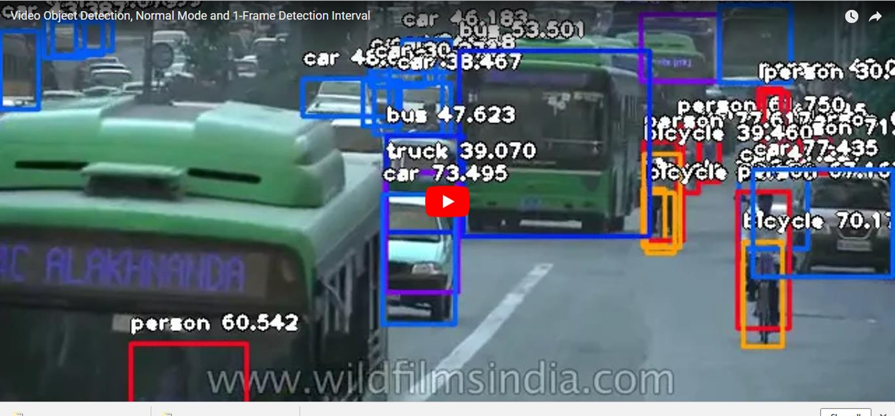
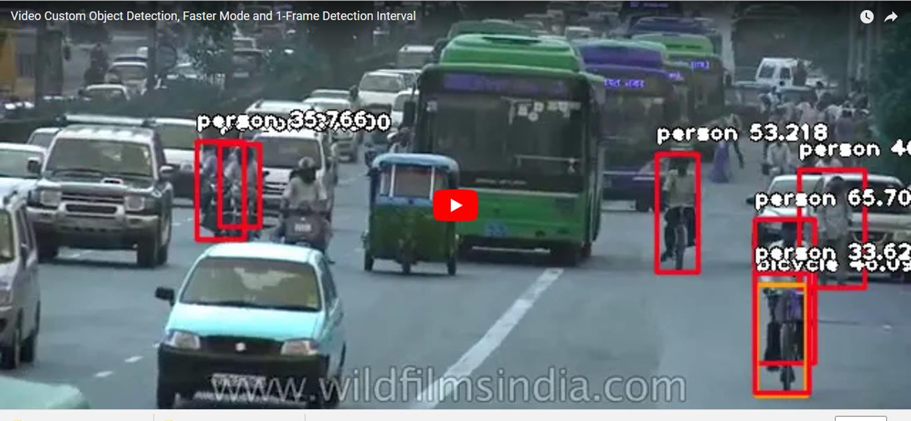
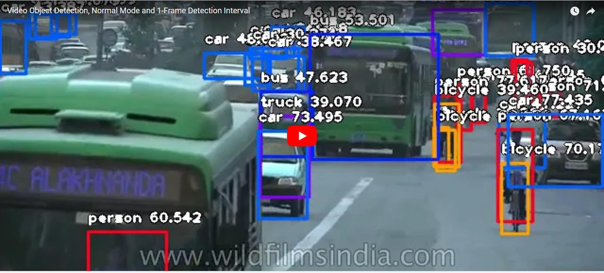

# ImageAI : Video Object Detection and Tracking (Preview Release) 

An <b>AI Commons</b> project <a href="https://commons.specpal.science" >https://commons.specpal.science </a>

 
<h3><b><u>TABLE OF CONTENTS</u></b></h3>
<a href="#videodetection" >&#9635 First Video Object Detection</a> 
<a href="#customvideodetection" >&#9635 Custom Video Object Detection (Object Tracking)</a> 
<a href="#videodetectionspeed" >&#9635 Detection Speed</a> 
<a href="#videodetectionintervals" >&#9635 Frame Detection Intervals</a> 
<a href="#documentation" >&#9635 Documentation</a> 
 
      ImageAI provides convenient, flexible and powerful methods to perform object detection on videos. The video object detection class provided only supports the current state-of-the-art RetinaNet,
while other object detection networks will be supported in the nearest future. This is a Preview release but capable lots of incredible options.
To start performing object detection, you must download the RetinaNet object detection via the link below:    
 <b>- <a href="https://github.com/OlafenwaMoses/ImageAI/releases/download/1.0/resnet50_coco_best_v2.0.1.h5" style="text-decoration: none;" >RetinaNet</a></b> <b>(Size = 145 mb) </b>   
Because video object detection is a compute intensive tasks, we advise you perform this experiment using a computer with a NVIDIA GPU and the GPU version of Tensorflow
 installed. Performing Video Object Detection CPU will be slower than using an NVIDIA GPU powered computer. You can use Google Colab for this
 experiment as it has an NVIDIA K80 GPU available.
   
 Once you download the RetinaNet model file, you should copy the model file to the your project folder where your .py files will be.
 Then create a python file and give it a name; an example is FirstVideoObjectDetection.py. Then write the code below into the python file:   

 <h3><b>FirstVideoObjectDetection.py</b></h3>

<pre>from imageai.Detection import VideoObjectDetection
import os

execution_path = os.getcwd()

detector = VideoObjectDetection()
detector.setModelTypeAsRetinaNet()
detector.setModelPath( os.path.join(execution_path , "resnet50_coco_best_v2.0.1.h5"))
detector.loadModel()

video_path = detector.detectObjectsFromVideo(input_file_path=os.path.join(execution_path, "traffic.mp4"),
                                output_file_path=os.path.join(execution_path, "traffic_detected")
                                , frames_per_second=20, log_progress=True)
print(video_path)
</pre>

          <b>
<i>Input Video (a 1min 24seconds video)</i>
</b>
          
          <b>
<i>Output Video</i>
</b>
          
C:\Users\User\PycharmProjects\ImageAITest\traffic_detected.avi

    
  

 
Let us make a breakdown of the object detection code that we used above.

<b><pre>
from imageai.Detection import VideoObjectDetection
import os

execution_path = os.getcwd()
</pre></b>
 In the 3 lines above , we import the <b>ImageAI video object detection </b> class in the first line, import the <b>os</b> in the second line and obtained
  the path to folder where our python file runs.
  <b><pre>
detector = VideoObjectDetection()
detector.setModelTypeAsRetinaNet()
detector.setModelPath( os.path.join(execution_path , "resnet50_coco_best_v2.0.1.h5"))
detector.loadModel()
  </pre></b>
  In the 4 lines above, we created a new instance of the <b>VideoObjectDetection</b> class in the first line, set the model type to RetinaNet in the second line,
  set the model path to the RetinaNet model file we downloaded and copied to the python file folder in the third line and load the model in the
   fourth line.

   <b><pre>
video_path = detector.detectObjectsFromVideo(input_file_path=os.path.join(execution_path, "traffic.mp4"),
                                output_file_path=os.path.join(execution_path, "traffic_detected")
                                , frames_per_second=20, log_progress=True)
print(video_path)
</pre></b>

In the 2 lines above, we ran the <b>detectObjectsFromVideo()</b> function and parse in the path to our video,the path to the new
 video (without the extension, it saves a .avi video by default) which the function will save, the number of frames per second (fps) that
 you we desire the output video to have and option to log the progress of the detection in the console. Then the function returns a the path to the saved video
 which contains boxes and percentage probabilities rendered on objects detected in the video.

<h3><b><u>Custom Video Object Detection</u></b></h3>
The video object detection model (<b>RetinaNet</b>) supported by <b>ImageAI</b> can detect 80 different types of objects. They include:  
<pre>
      person,   bicycle,   car,   motorcycle,   airplane,
          bus,   train,   truck,   boat,   traffic light,   fire hydrant,   stop_sign,
          parking meter,   bench,   bird,   cat,   dog,   horse,   sheep,   cow,   elephant,   bear,   zebra,
          giraffe,   backpack,   umbrella,   handbag,   tie,   suitcase,   frisbee,   skis,   snowboard,
          sports ball,   kite,   baseball bat,   baseball glove,   skateboard,   surfboard,   tennis racket,
          bottle,   wine glass,   cup,   fork,   knife,   spoon,   bowl,   banana,   apple,   sandwich,   orange,
          broccoli,   carrot,   hot dog,   pizza,   donot,   cake,   chair,   couch,   potted plant,   bed,
          dining table,   toilet,   tv,   laptop,   mouse,   remote,   keyboard,   cell phone,   microwave,
          oven,   toaster,   sink,   refrigerator,   book,   clock,   vase,   scissors,   teddy bear,   hair dryer,
          toothbrush.
</pre>

Interestingly, <b>ImageAI</b> allow you to perform  detection for one or more of the items above. That means you can
 customize the type of object(s) you want to be detected in the video. Let's take a look at the code below:  

<pre>from imageai.Detection import VideoObjectDetection
import os

execution_path = os.getcwd()

detector = VideoObjectDetection()
detector.setModelTypeAsRetinaNet()
detector.setModelPath( os.path.join(execution_path , "resnet50_coco_best_v2.0.1.h5"))
detector.loadModel()

custom_objects = detector.CustomObjects(person=True, bicycle=True, motorcycle=True)

video_path = detector.detectCustomObjectsFromVideo(custom_objects=custom_objects, input_file_path=os.path.join(execution_path, "traffic.mp4"),
                                output_file_path=os.path.join(execution_path, "traffic_custom_detected")
                                , frames_per_second=20, log_progress=True)
print(video_path)

</pre>

Let us take a look at the part of the code that made this possible.
<pre>custom_objects = detector.CustomObjects(person=True, bicycle=True, motorcycle=True)

video_path = detector.detectCustomObjectsFromVideo(custom_objects=custom_objects, input_file_path=os.path.join(execution_path, "traffic.mp4"),
                                output_file_path=os.path.join(execution_path, "traffic_custom_detected")
                                , frames_per_second=20, log_progress=True)
</pre>
In the above code, after loading the model (can be done before loading the model as well), we defined a new variable
"<b>custom_objects = detector.CustomObjects()</b>", in which we set its person, car and motorccyle properties equal to <b>True</b>.
This is to tell the model to detect only the object we set to True. Then we call the "<b>detector.detectCustomObjectsFromVideo()</b>"
which is the function that allows us to perform detection of custom objects. Then we will set the "<b>custom_objects</b>" value
 to the custom objects variable we defined.

<b>
<i>Output Video</i>
</b>

C:\Users\User\PycharmProjects\ImageAITest\traffic_custom_detected.avi

    
  

  

<h3><b><u>Video Detection Speed</u></b></h3>
<b> ImageAI </b> now provides detection speeds for all video object detection tasks. The detection speeds allow you to reduce
 the time of detection at a rate between 20% - 80%, and yet having just slight changes but accurate detection
results. Coupled with lowering the <b>minimum_percentage_probability</b> parameter, detections can closely match the normal
speed and yet reduce detection time drastically. The available detection speeds are <b>"normal"</b>(default), <b>"fast"</b>, <b>"faster"</b> , <b>"fastest"</b> and <b>"flash"</b>.
All you need to do is to state the speed mode you desire when loading the model as seen below.

<b><pre>detector.loadModel(detection_speed="fast")</pre></b>  

To observe the differences in the detection speeds, look below for each speed applied to object detection with
 coupled with the adjustment of the minimum_percentage_probability , time taken to detect and detections given.
The results below are obtained from detections performed on a NVIDIA K80 GPU. Links are provided below to download
 the videos for each detection speed applied.   

<b><i>Video Length = 1min 24seconds, Detection Speed = "normal" , Minimum Percentage Probability = 50 (default), Detection Time = 29min 3seconds </i></b>

   

   

<b><i>Video Length = 1min 24seconds, Detection Speed = "fast" , Minimum Percentage Probability = 40, Detection Time = 11min 6seconds </i></b>    
<a href="https://drive.google.com/open?id=118m6UnEG7aFdzxO7uhO_6C-981LJ3Gpf" ><button style="font-size: 12px; color: white; background-color: blue; height: 20px " > >>> Download detected video at speed "fast" </button></a>
   

<b><i>Video Length = 1min 24seconds, Detection Speed = "faster" , Minimum Percentage Probability = 30, Detection Time = 7min 47seconds </i></b>    
<a href="https://drive.google.com/open?id=1s1FQWFsEX1Yf4FvUPVleK7vRxaQ6pgUy" ><button style="font-size: 12px; color: white; background-color: blue; height: 20px " > >>> Download detected video at speed "faster" </button></a>
   

<b><i>Video Length = 1min 24seconds, Detection Speed = "fastest" , Minimum Percentage Probability = 20, Detection Time = 6min 20seconds </i></b>    
<a href="https://drive.google.com/open?id=1Wlt0DTGxl-JX7otd30MH4qhURv0rG9rw" ><button style="font-size: 12px; color: white; background-color: blue; height: 20px " > >>> Download detected video at speed "fastest" </button></a>
   

<b><i>Video Length = 1min 24seconds, Detection Speed = "flash" , Minimum Percentage Probability = 10, Detection Time = 3min 55seconds </i></b>    
<a href="https://drive.google.com/open?id=1V3irCpP49bEUtpjG7Vuk6vEQQAZI-4PI" ><button style="font-size: 12px; color: white; background-color: blue; height: 20px " > >>> Download detected video at speed "flash" </button></a>
  
If you use more powerful NVIDIA GPUs, you will definitely have faster detection time than stated above.

   

<h3><b><u>Frame Detection Intervals</u></b></h3>
The above video objects detection task are optimized for frame-real-time object detections that ensures that objects in every frame
of the video is detected. <b>ImageAI</b> provides you the option to adjust the video frame detections which can speed up
your video detection process. When calling the <b>.detectObjectsFromVideo()</b> or <b>.detectCustomObjectsFromVideo()</b>, you can
specify at which frame interval detections should be made. By setting the <b>frame_detection_interval</b> parameter to be
 equal to 5 or 20, that means the object detections in the video will be updated after 5 frames or 20 frames.
If your output video <b>frames_per_second</b> is set to 20, that means the object detections in the video will
 be updated once in every quarter of a second or every second. This is useful in case scenarious where the available
 compute is less powerful and speeds of moving objects are low. This ensures you can have objects detected as second-real-time
, half-a-second-real-time or whichever way suits your needs. We conducted video object detection on the same input
 video we have been using all this while by applying a <b>frame_detection_interval</b> value equal to 5.
The results below are obtained from detections performed on a NVIDIA K80 GPU.
See the results and link to download the videos below:
   
<b><i>Video Length = 1min 24seconds, Detection Speed = "normal" , Minimum Percentage Probability = 50 (default), Frame Detection Interval = 5, Detection Time = 15min 49seconds  </i></b>

   <a href="https://drive.google.com/open?id=10m6kXlXWGOGc-IPw6TsKxBi-SXXOH9xK" ><button style="font-size: 12px; color: white; background-color: blue; height: 20px " > >>> Download detected video at speed "normal" and interval=5 </button></a>

  

<b><i>Video Length = 1min 24seconds, Detection Speed = "fast" , Minimum Percentage Probability = 40, Frame Detection Interval = 5, Detection Time = 5min 6seconds  </i></b>

   <a href="https://drive.google.com/open?id=17934YONVSXvd4uuJE0KwenEFks7fFYe4" ><button style="font-size: 12px; color: white; background-color: blue; height: 20px " > >>> Download detected video at speed "fast" and interval=5 </button></a>

  

<b><i>Video Length = 1min 24seconds, Detection Speed = "faster" , Minimum Percentage Probability = 30, Frame Detection Interval = 5, Detection Time = 3min 18seconds  </i></b>

   <a href="https://drive.google.com/open?id=1cs_06CuhXDvZp3fHJWFpam-31eclOhc-" ><button style="font-size: 12px; color: white; background-color: blue; height: 20px " > >>> Download detected video at speed "faster" and interval=5 </button></a>

  

<b><i>Video Length = 1min 24seconds, Detection Speed = "fastest" , Minimum Percentage Probability = 20 , Frame Detection Interval = 5, Detection Time = 2min 18seconds  </i></b>

<a href="https://www.youtube.com/embed/S-jgBTQgbd4?rel=0" >

  

   

<b><i>Video Length = 1min 24seconds, Detection Speed = "flash" , Minimum Percentage Probability = 10, Frame Detection Interval = 5, Detection Time = 1min 27seconds  </i></b>

   <a href="https://drive.google.com/open?id=1aN2nnVoFjhUWpcz2Und3dsCT9OKrakM0" ><button style="font-size: 12px; color: white; background-color: blue; height: 20px " > >>> Download detected video at speed "flash" and interval=5 </button></a>

    

<h3><b><u>Documentation</u></b></h3>

<b>imageai.Detection.VideoObjectDetection </b> class 

          The <b>VideoObjectDetection</b> class can be used to perform object detection on videos,  by instantiating it and calling the available functions below:  
            <b>- setModelTypeAsRetinaNet()</b>    This function should be called
            to use the RetinaNet model file for object detection. You only need to call it once.  
            <b>- setModelPath()</b>    You need to call this function only once and parse the path to
       the model file path into it. The model file type must correspond to the model type you set.   
             <b>- loadModel()</b>      This function is required and is used to load the model structure into the program from the file path defined  
                in the setModelPath() function. This function receives an optional value which is "detection_speed".  
                The value is used to reduce the time it takes to detect objects in a video, down to about a 10% of the normal time, with  
                 with just slight reduction in the number of objects detected.     ***** prediction_speed (optional); Acceptable values are "normal", "fast", "faster", "fastest" and "flash"    :param detection_speed:  
                :return:     
            <b>- detectObjectsFromVideo()</b> This function is used to detect objects observable in the given video path:    
                            ****** input_file_path , which is the file path to the input video  
                            ****** output_file_path , which is the path to the output video  
                            ****** frames_per_second , which is the number of frames to be used in the output video  
                            ****** frame_detection_interval (optional, 1 by default)  , which is the intervals of frames that will be detected.  
                            ****** minimum_percentage_probability (optional, 50 by default) , option to set the minimum percentage probability for nominating a detected object for output.  
                            ****** log_progress (optional) , which states if the progress of the frame processed is to be logged to console    :param input_file_path:  
                    :param output_file_path:  
                    :param frames_per_second:  
                    :param frame_detection_interval:  
                    :param minimum_percentage_probability:  
                    :param log_progress:  
                    :return output_video_filepath:     
    <b>- CustomObjecs()</b>  This function can be optionally called to handpick the type of objects you want to detect  
                         from a video. The objects are pre-initiated in the function variables and predefined as 'False',  
                         which you can easily set to true for any number of objects available.  This function  
                         returns a dictionary which must be parsed into the 'detectCustomObjectsFromVideo()'. Detecting  
                          custom objects only happens when you call the function 'detectCustomObjectsFromVideo()'     ****** true_values_of_objects (array); Acceptable values are 'True' and False  for all object values present    :param boolean_values:  
                        :return: custom_objects_dict       <b>- detectCustomObjectsFromVideo()</b> This function is used to detect specific object(s) observable in the given video path:    
                            * custom_objects , which is the dictionary returned by the 'CustomObjects' function  
                            * input_file_path , which is the file path to the input video  
                            * output_file_path , which is the path to the output video  
                            * frames_per_second , which is the number of frames to be used in the output video  
                            * frame_detection_interval (optional, 1 by default) , which is the intervals of frames that will be detected.  
                            * minimum_percentage_probability (optional, 50 by default) , option to set the minimum percentage probability for nominating a detected object for output.  
                            * log_progress (optional) , which states if the progress of the frame processed is to be logged to console    :param custom_objects:  
                    :param input_file_path:  
                    :param output_file_path:  
                    :param frames_per_second:  
                    :param frame_detection_interval:  
                    :param minimum_percentage_probability:  
                    :param log_progress:  
                    :return output_video_filepath:  
