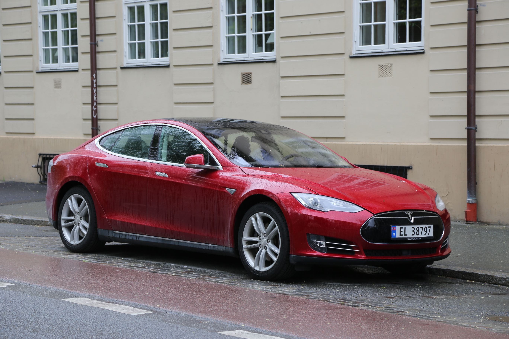
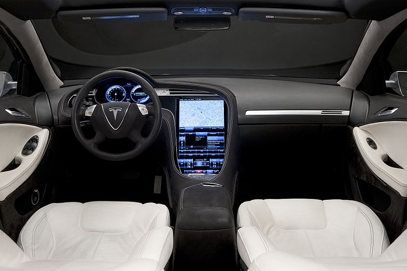

# ImageAI : Image Prediction  

An <b>AI Commons</b> project <a href="https://commons.specpal.science" >https://commons.specpal.science </a>

 
<h3><b><u>TABLE OF CONTENTS</u></b></h3>
<a href="#firstprediction" >&#9635 First Prediction</a> 
<a href="#predictionspeed" >&#9635 Prediction Speed</a> 
<a href="#inputtype" >&#9635 Image Input Types</a> 
<a href="#multiprediction" >&#9635 Multiple Images Prediction</a> 
<a href="#threadprediction" >&#9635 Prediction in MultiThreading</a> 
<a href="#support" >&#9635 Support the ImageAI Project</a> 
<a href="#documentation" >&#9635 Documentation</a> 
 
      ImageAI provides 4 different algorithms and model types to perform image prediction.
To perform image prediction on any picture, take the following simple steps.  The 4 algorithms provided for
 image prediction include <b>SqueezeNet</b>, <b>ResNet</b>, <b>InceptionV3</b> and <b>DenseNet</b>. Each of these
  algorithms have individual model files which you must use depending on the choice of your algorithm. To download the
   model file for your choice of algorithm, click on any of the links below:    
       <b>- <a href="https://github.com/OlafenwaMoses/ImageAI/releases/download/1.0/squeezenet_weights_tf_dim_ordering_tf_kernels.h5" style="text-decoration: none;" >SqueezeNet</a> (Size = 4.82 mb, fastest prediction time and moderate accuracy) </b>  
       <b>- <a href="https://github.com/OlafenwaMoses/ImageAI/releases/download/1.0/resnet50_weights_tf_dim_ordering_tf_kernels.h5" style="text-decoration: none;" >ResNet50</a></b> by Microsoft Research <b>(Size = 98 mb, fast prediction time and high accuracy) </b>  
       <b>- <a href="https://github.com/OlafenwaMoses/ImageAI/releases/download/1.0/inception_v3_weights_tf_dim_ordering_tf_kernels.h5" style="text-decoration: none;" >InceptionV3</a></b> by Google Brain team <b>(Size = 91.6 mb, slow prediction time and higher accuracy) </b>  
       <b>- <a href="https://github.com/OlafenwaMoses/ImageAI/releases/download/1.0/DenseNet-BC-121-32.h5" style="text-decoration: none;" >DenseNet121</a></b> by Facebook AI Research <b>(Size = 31.6 mb, slower prediction time and highest accuracy) </b>   
 Great! Once you have downloaded this model file, start a new python project, and then copy the model file to your project
     folder where your python files (.py files) will be . Download the image below, or take any image on your computer
 and copy it to your python project's folder. Then create a python file and give it a name; an example is <b>FirstPrediction.py</b>.
      Then write the code below into the python file:   

<h3><b>FirstPrediction.py</b></h3>
<b><pre>
from imageai.Prediction import ImagePrediction
import os

execution_path = os.getcwd()

prediction = ImagePrediction()
prediction.setModelTypeAsResNet()
prediction.setModelPath(os.path.join(execution_path, "resnet50_weights_tf_dim_ordering_tf_kernels.h5"))
prediction.loadModel()

predictions, probabilities = prediction.predictImage(os.path.join(execution_path, "1.jpg"), result_count=5 )
for eachPrediction, eachProbability in zip(predictions, probabilities):
    print(eachPrediction + " : " + eachProbability)

</pre></b>

Sample Result:  
    <pre>convertible : 52.459555864334106
sports_car : 37.61284649372101
pickup : 3.1751200556755066
car_wheel : 1.817505806684494
minivan : 1.7487050965428352</pre>

 

          The code above works as follows:  
     <b><pre>from imageai.Prediction import ImagePrediction
import os</pre></b>
 
      The code above imports the <b>ImageAI</b> library
 and the python <b>os</b> class.  
<b><pre>execution_path = os.getcwd()</pre></b>
  The above line obtains the path to the folder that contains
your python file (in this example, your FirstPrediction.py) .  

<b><pre>prediction = ImagePrediction()
prediction.setModelTypeAsResNet()
prediction.setModelPath(os.path.join(execution_path, "resnet50_weights_tf_dim_ordering_tf_kernels.h5"))</pre></b>
      In the lines above, we created and instance of the <b>ImagePrediction()</b>
 class in the first line, then we set the model type of the prediction object to ResNet by caling the <b>.setModelTypeAsResNet()</b>
  in the second line and then we set the model path of the prediction object to the path of the model file (<b>resnet50_weights_tf_dim_ordering_tf_kernels.h5</b>) we copied to the python file folder
   in the third line.

<b><pre>predictions, probabilities = prediction.predictImage(os.path.join(execution_path, "1.jpg"), result_count=5 )</pre></b> In the above line, we defined 2 variables to be equal to the function
 called to predict an image, which is the <b>.predictImage()</b> function, into which we parsed the path to
 our image and also state the number of prediction results we want to have (values from 1 to 1000) parsing
 <b> result_count=5 </b>. The <b>.predictImage()</b> function will return 2 array objects with the first (<b>predictions</b>) being
  an array of predictions and the second (<b>percentage_probabilities</b>) being an array of the corresponding percentage probability for each
  prediction.

  <b><pre>for eachPrediction, eachProbability in zip(predictions, probabilities):
    print(eachPrediction + " : " + eachProbability)</pre></b> The above line obtains each object in the <b>predictions</b> array, and also
obtains the corresponding percentage probability from the <b>percentage_probabilities</b>, and finally prints
the result of both to console.

  

<h3><b><u>  >> Multiple Images Prediction</u></b></h3>
 You can run image prediction on more than one image using a single function, which is the <b>.predictMultipleImages()</b>
  function. It works by doing the following:  
  - Define your normal <b>ImagePrediction</b> instance  
  - Set the model type and model path  
  - Call the <b>.loadModel()</b> function  
  - Create an array and add all the string path to each of the images you want to predict to the array.  
  - You then perform prediction by calling the <b>.predictMultipleImages()</b> function and parse in the array of images, and also set the number
   predictions you want per image by parsing <b>result_count_per_image=5</b> (default value is 2)   

  Find the sample code below:  
  <b><pre>
from imageai.Prediction import ImagePrediction
import os

execution_path = os.getcwd()

multiple_prediction = ImagePrediction()
multiple_prediction.setModelTypeAsResNet()
multiple_prediction.setModelPath(os.path.join(execution_path, "resnet50_weights_tf_dim_ordering_tf_kernels.h5"))
multiple_prediction.loadModel()

all_images_array = []

all_files = os.listdir(execution_path)
for each_file in all_files:
    if(each_file.endswith(".jpg") or each_file.endswith(".png")):
        all_images_array.append(each_file)

results_array = multiple_prediction.predictMultipleImages(all_images_array, result_count_per_image=5)

for each_result in results_array:
    predictions, percentage_probabilities = each_result["predictions"], each_result["percentage_probabilities"]
    for index in range(len(predictions)):
        print(predictions[index] + " : " + percentage_probabilities[index])
    print("-----------------------")</pre></b>  
    In the above code, the <b>.predictMultipleImages()</b> function will return an array which contains a dictionary per image.
 Each dictionary contains the arrays for predictions and percentage probability for each prediction.  
    
Sample Result:

     
    

          
          
          
    

<pre>
convertible : 52.459555864334106
sports_car : 37.61284649372101
pickup : 3.1751200556755066
car_wheel : 1.817505806684494
minivan : 1.7487050965428352
-----------------------
toilet_tissue : 13.99008333683014
jeep : 6.842949986457825
car_wheel : 6.71963095664978
seat_belt : 6.704962253570557
minivan : 5.861184373497963
-----------------------
bustard : 52.03368067741394
vulture : 20.936034619808197
crane : 10.620515048503876
kite : 10.20539253950119
white_stork : 1.6472270712256432
-----------------------</pre>

  

<h3><b><u> >> Prediction Speed</u></b></h3>
<b> ImageAI </b> now provides prediction speeds for all image prediction tasks. The prediction speeds allow you to reduce
 the time of prediction at a rate between 20% - 60%, and yet having just slight changes but accurate prediction
 results. The available prediction speeds are <b>"normal"</b>(default), <b>"fast"</b>, <b>"faster"</b> and <b>"fastest"</b>.
All you need to do is to state the speed mode you desire when loading the model as seen below.

<b><pre>prediction.loadModel(prediction_speed="fast")</pre></b>  

To observe the differences in the prediction speeds, look below for each speed applied to multiple prediction with
time taken to predict and predictions given. The results below are obtained from predictions performed
 on a Windows 8 laptop with Intel Celeron N2820 CPU, with processor speed of 2.13GHz   

<b><i>Prediction Speed = "normal" , Prediction Time = 5.9 seconds </i></b>
<pre>
convertible : 52.459555864334106
sports_car : 37.61284649372101
pickup : 3.1751200556755066
car_wheel : 1.817505806684494
minivan : 1.7487050965428352
-----------------------
toilet_tissue : 13.99008333683014
jeep : 6.842949986457825
car_wheel : 6.71963095664978
seat_belt : 6.704962253570557
minivan : 5.861184373497963
-----------------------
bustard : 52.03368067741394
vulture : 20.936034619808197
crane : 10.620515048503876
kite : 10.20539253950119
white_stork : 1.6472270712256432
-----------------------</pre>

   

<b><i>Prediction Speed = "fast" , Prediction Time = 3.4 seconds </i></b>
<pre>
sports_car : 55.5136501789093
pickup : 19.860029220581055
convertible : 17.88402795791626
tow_truck : 2.357563190162182
car_wheel : 1.8646160140633583
-----------------------
drum : 12.241223454475403
toilet_tissue : 10.96322312951088
car_wheel : 10.776633024215698
dial_telephone : 9.840480983257294
toilet_seat : 8.989936858415604
-----------------------
vulture : 52.81011462211609
bustard : 45.628002285957336
kite : 0.8065823465585709
goose : 0.3629807382822037
crane : 0.21266008261591196
-----------------------</pre>

   

<b><i>Prediction Speed = "faster" , Prediction Time = 2.7 seconds </i></b>
<pre>
sports_car : 79.90474104881287
tow_truck : 9.751049429178238
convertible : 7.056044787168503
racer : 1.8735893070697784
car_wheel : 0.7379394955933094
-----------------------
oil_filter : 73.52778315544128
jeep : 11.926891654729843
reflex_camera : 7.9965077340602875
Polaroid_camera : 0.9798810817301273
barbell : 0.8661789819598198
-----------------------
vulture : 93.00530552864075
bustard : 6.636220961809158
kite : 0.15161558985710144
bald_eagle : 0.10513027664273977
crane : 0.05982434959150851
-----------------------</pre>

   

<b><i>Prediction Speed = "fastest" , Prediction Time = 2.2 seconds </i></b>
<pre>
tow_truck : 62.5033438205719
sports_car : 31.26143217086792
racer : 2.2139860317111015
fire_engine : 1.7813067883253098
ambulance : 0.8790366351604462
-----------------------
reflex_camera : 94.00787949562073
racer : 2.345871739089489
jeep : 1.6016140580177307
oil_filter : 1.4121259562671185
lens_cap : 0.1283118617720902
-----------------------
kite : 98.5377550125122
vulture : 0.7469987496733665
bustard : 0.36855682265013456
bald_eagle : 0.2437378279864788
great_grey_owl : 0.0699841941241175
-----------------------</pre>

<h3>PLEASE NOTE:</h3>  When adjusting speed modes, it is best to use models that have higher accuracies
 like the DenseNet or InceptionV3 models, or use it in case scenarios where the images predicted are iconic.

  

<h3><b><u> >> Image Input Types</u></b></h3>
Previous version of <b>ImageAI</b> supported only file inputs and accepts file paths to an image for image prediction.
Now, <b>ImageAI</b> supports 3 input types which are <b>file path to image file</b>(default), <b>numpy array of image</b> and <b>image file stream</b>.
This means you can now perform image prediction in production applications such as on a web server and system
 that returns file in any of the above stated formats.
  To perform image prediction with numpy array or file stream input, you just need to state the input type
in the <b>.predictImage()</b> function or the <b>.predictMultipleImages()</b> function. See example below.

<pre>predictions, probabilities = prediction.predictImage(image_array, result_count=5 , input_type="array" ) # For numpy array input type
predictions, probabilities = prediction.predictImage(image_stream, result_count=5 , input_type="stream" ) # For file stream input type</pre>

  

<h3><b><u> >> Prediction in MultiThreading</u></b></h3> When developing programs that run heavy task on the deafult thread like User Interfaces (UI),
 you should consider running your predictions in a new thread. When running image prediction using ImageAI in
 a new thread, you must take note the following:  
         - You can create your prediction object, set its model type, set model path and json path
outside the new thread.  
          - The <b>.loadModel()</b> must be in the new thread and image prediction (<b>predictImage()</b>) must take place in th new thread.
 
      Take a look of a sample code below on image prediction using multithreading:
<pre><b>
from imageai.Prediction import ImagePrediction
import os
import threading

execution_path = os.getcwd()

prediction = ImagePrediction()
prediction.setModelTypeAsResNet()
prediction.setModelPath( os.path.join(execution_path, "resnet50_weights_tf_dim_ordering_tf_kernels.h5"))

picturesfolder = os.environ["USERPROFILE"] + "\\Pictures\\"
allfiles = os.listdir(picturesfolder)

class PredictionThread(threading.Thread):
    def __init__(self):
        threading.Thread.__init__(self)
    def run(self):
        prediction.loadModel()
        for eachPicture in allfiles:
            if eachPicture.endswith(".png") or eachPicture.endswith(".jpg"):
                predictions, percentage_probabilities = prediction.predictImage(picturesfolder + eachPicture, result_count=1)
                for prediction, percentage_probability in zip(predictions, probabilities):
                    print(prediction + " : " + percentage_probability)

predictionThread = PredictionThread ()
predictionThread.start()
    </b></pre>  

 <h3><b><u>Support the ImageAI Project</u></b></h3>

The <b>ImageAI</b> project is <b>free and open-source</b>. We are devoting lots of time and effort to provide industrial grade and the best of computer vision tools using state-of-the-art machine learning algorithms, in a way that amateur, intermediate and professional developers and researcher will find easy, convenient, independent and at no cost. We are asking the support of everyone who appreciates, uses and share in our dream for this project. Visit the link below to our <b>Indiegogo campaign</b> to contribute a token, or something substantial which will earn you an exclusive free E-Book that covers tutorials and full sample codes on using <b>ImageAI</b> for real-life and large-scale projects.
 
<b><h3> [ >>> Support ImageAI on Indiegogo]() </h3></b>
With your contributions, we will be adding more features including the ones requested by users of <b>ImageAI</b> that has contacted us. Some of the features are :    
<b> 1) Custom training of Object Detection Models using RetinaNet, YOLOv3 and TinyYOLOv3</b>  
<b> 2) Image Segmentation</b>  
<b> 3) Face, Gender and Age Detection</b>  
<b> 4) Vehicle Number Plate Detection Recognition</b>  
<b> 5) ImageAI and all its features for Android</b> (For integrating all ImageAI features into Android Applications)  
<b> 6) ImageAI and all its features for iOS</b> (For integrating all ImageAI features into iOS Applications)  
<b> 7) ImageAI and all its features for .NET</b> (ImageAI and all its features for .NET developers)  

<h3><b><u>  >> Documentation</u></b></h3>
We have provided full documentation for all <b>ImageAI</b> classes and functions in 2 major languages. Find links below:  

<b> >> Documentation - English Version  [https://imageai.readthedocs.io](https://imageai.readthedocs.io)</b>  
<b> >> Documentation - Chinese Version  [https://imageai-cn.readthedocs.io](https://imageai-cn.readthedocs.io)</b>

