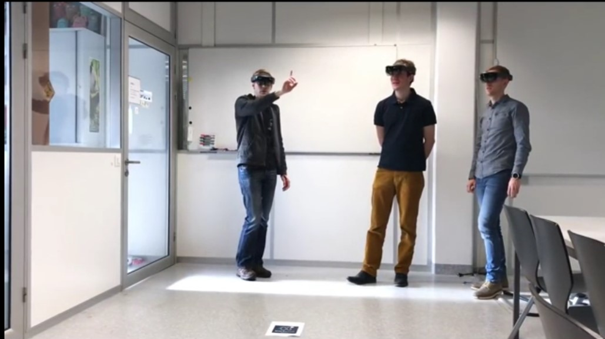

# ImageAI : Custom Video Object Detection, Tracking  and Analysis

An **DeepQuest AI** project [https://deepquestai.com](https://deepquestai.com)

---

### TABLE OF CONTENTS

- <a href="#videodetection" > :white_square_button: First Custom Video Object Detection</a>
- <a href="#camerainputs" > :white_square_button: Camera / Live Stream Video Detection</a>
- <a href="#videoanalysis" > :white_square_button: Video Analysis</a>
- <a href="#hidingdetails" > :white_square_button: Hiding/Showing Object Name and Probability</a>
- <a href="#videodetectionintervals" > :white_square_button: Frame Detection Intervals</a>
- <a href="#detectiontimeout" > :white_square_button: Video Detection Timeout (NEW)</a>
- <a href="#documentation" > :white_square_button: Documentation</a>


ImageAI provides convenient, flexible and powerful methods to perform object detection on videos using your own **custom YOLOv3 model** and the corresponding **detection_config.json** generated during the training. This version of **ImageAI** provides commercial grade video objects detection features, which include but not limited to device/IP camera inputs, per frame, per second, per minute and entire video analysis for storing in databases and/or real-time visualizations and for future insights.
To test the custom video object detection,you can download a sample custom model we have trained to detect the Hololens headset and its **detection_config.json** file via the links below:
- [**hololens-ex-60--loss-2.76.h5**](https://github.com/OlafenwaMoses/ImageAI/releases/download/essential-v4/hololens-ex-60--loss-2.76.h5) _(Size = 236 mb)_
- [**detection_config.json**](https://github.com/OlafenwaMoses/ImageAI/releases/download/essential-v4/detection_config.json)


Because video object detection is a compute intensive tasks, we advise you perform this experiment using a computer with a NVIDIA GPU and the GPU version of Tensorflow
 installed. Performing Video Object Detection CPU will be slower than using an NVIDIA GPU powered computer. You can use Google Colab for this
 experiment as it has an NVIDIA K80 GPU available for free.
<br/>
 Once you download the custom object detection model  and JSON files, you should copy the model and the JSON files to the your project folder where your .py files will be.
 Then create a python file and give it a name; an example is FirstCustomVideoObjectDetection.py. Then write the code below into the python file: <br/>


### FirstCustomVideoObjectDetection.py
<div id="videodetection" ></div>

```python
from imageai.Detection.Custom import CustomVideoObjectDetection
import os

execution_path = os.getcwd()

video_detector = CustomVideoObjectDetection()
video_detector.setModelTypeAsYOLOv3()
video_detector.setModelPath("hololens-ex-60--loss-2.76.h5")
video_detector.setJsonPath("detection_config.json")
video_detector.loadModel()

video_detector.detectObjectsFromVideo(input_file_path="holo1.mp4",
                                          output_file_path=os.path.join(execution_path, "holo1-detected3"),
                                          frames_per_second=20,
                                          minimum_percentage_probability=40,
                                          log_progress=True)
```

[**Input Video**](../../../data-videos/holo1.mp4)
[](../../../data-videos/holo1.mp4)
[**Output Video**](https://www.youtube.com/watch?v=4o5GyAR4Mpw)
[](https://www.youtube.com/watch?v=4o5GyAR4Mpw)


Let us make a breakdown of the object detection code that we used above.

```python
from imageai.Detection.Custom import CustomVideoObjectDetection
import os

execution_path = os.getcwd()
```

In the 3 lines above , we import the **ImageAI custom video object detection** class in the first line, import the **os** in the second line and obtained
  the path to folder where our python file runs.
```python
video_detector = CustomVideoObjectDetection()
video_detector.setModelTypeAsYOLOv3()
video_detector.setModelPath("hololens-ex-60--loss-2.76.h5")
video_detector.setJsonPath("detection_config.json")
video_detector.loadModel()
```
In the 4 lines above, we created a new instance of the `CustomVideoObjectDetection` class in the first line, set the model type to YOLOv3 in the second line,
  set the model path to our custom YOLOv3 model file in the third line, specified the path to the model's corresponding **detection_config.json** in the fourth line and load the model in the fifth line.

```python
video_detector.detectObjectsFromVideo(input_file_path="holo1.mp4",
                                          output_file_path=os.path.join(execution_path, "holo1-detected3"),
                                          frames_per_second=20,
                                          minimum_percentage_probability=40,
                                          log_progress=True)
```

In the code above, we ran the `detectObjectsFromVideo()` function and parse in the path to our video,the path to the new
 video (without the extension, it saves a .avi video by default) which the function will save, the number of frames per second (fps) that
 you we desire the output video to have and option to log the progress of the detection in the console. Then the function returns a the path to the saved video
 which contains boxes and percentage probabilities rendered on objects detected in the video.


### Camera / Live Stream Video Detection
<div id="camerainputs"></div>

**ImageAI** now allows live-video detection with support for camera inputs. Using **OpenCV**'s **VideoCapture()** function, you can load live-video streams from a device camera, cameras connected by cable or IP cameras, and parse it into **ImageAI**'s **detectObjectsFromVideo()** function. All features that are supported for detecting objects in a video file is also available for detecting objects in a camera's live-video feed. Find below an example of detecting live-video feed from the device camera. 

```python
from imageai.Detection.Custom import CustomVideoObjectDetection
import os
import cv2

execution_path = os.getcwd()
camera = cv2.VideoCapture(0)

video_detector = CustomVideoObjectDetection()
video_detector.setModelTypeAsYOLOv3()
video_detector.setModelPath("hololens-ex-60--loss-2.76.h5")
video_detector.setJsonPath("detection_config.json")
video_detector.loadModel()

video_detector.detectObjectsFromVideo(camera_input=camera,
                                          output_file_path=os.path.join(execution_path, "holo1-detected3"),
                                          frames_per_second=20,
                                          minimum_percentage_probability=40,
                                          log_progress=True)
```

The difference in the code above and the code for the detection of a video file is that we defined an **OpenCV VideoCapture** instance and loaded the default device camera into it. Then we parsed the camera we defined into the parameter **camera_input** which replaces the **input_file_path** that is used for video file. 


### Video Analysis
<div id="videoanalysis"></div>

**ImageAI** now provide commercial-grade video analysis in the Custom Video Object Detection class, for both video file inputs and camera inputs. This feature allows developers to obtain deep insights into any video processed with **ImageAI**. This insights can be visualized in real-time, stored in a NoSQL database for future review or analysis. <br/>

For video analysis, the **detectObjectsFromVideo()** now allows you to state your own defined functions which will be executed for every frame, seconds and/or minute of the video detected as well as a state a function that will be executed at the end of a video detection. Once this functions are stated, they will receive raw but comprehensive analytical data on the index of the frame/second/minute, objects detected (name, percentage_probability and box_points), number of instances of each unique object detected and average number of occurrence of each unique object detected over a second/minute and entire video.

To obtain the video analysis, all you need to do is specify a function, state the corresponding parameters it will be receiving and parse the function name into the **per_frame_function**, **per_second_function**, **per_minute_function** and **video_complete_function** parameters in the detection function. Find below examples of video analysis functions. 

```python
def forFrame(frame_number, output_array, output_count):
    print("FOR FRAME " , frame_number)
    print("Output for each object : ", output_array)
    print("Output count for unique objects : ", output_count)
    print("------------END OF A FRAME --------------")

def forSeconds(second_number, output_arrays, count_arrays, average_output_count):
    print("SECOND : ", second_number)
    print("Array for the outputs of each frame ", output_arrays)
    print("Array for output count for unique objects in each frame : ", count_arrays)
    print("Output average count for unique objects in the last second: ", average_output_count)
    print("------------END OF A SECOND --------------")

def forMinute(minute_number, output_arrays, count_arrays, average_output_count):
    print("MINUTE : ", minute_number)
    print("Array for the outputs of each frame ", output_arrays)
    print("Array for output count for unique objects in each frame : ", count_arrays)
    print("Output average count for unique objects in the last minute: ", average_output_count)
    print("------------END OF A MINUTE --------------")

video_detector = CustomVideoObjectDetection()
video_detector.setModelTypeAsYOLOv3()
video_detector.setModelPath("hololens-ex-60--loss-2.76.h5")
video_detector.setJsonPath("detection_config.json")
video_detector.loadModel()

video_detector.detectObjectsFromVideo(camera_input=camera,
                                          output_file_path=os.path.join(execution_path, "holo1-detected3"),
                                          frames_per_second=20, per_second_function=forSeconds, per_frame_function = forFrame, per_minute_function= forMinute,
                                          minimum_percentage_probability=40,
                                          log_progress=True)
```


**ImageAI** also allows you to obtain complete analysis of the entire video processed. All you need is to define a function like the forSecond or forMinute function and set the **video_complete_function** parameter into your **.detectObjectsFromVideo()** function. The same values for the per_second-function and per_minute_function will be returned. The difference is that no index will be returned and the other 3 values will be returned, and the 3 values will cover all frames in the video. Below is a sample function: 
```python
def forFull(output_arrays, count_arrays, average_output_count):
    #Perform action on the 3 parameters returned into the function


video_detector.detectObjectsFromVideo(camera_input=camera,
                                          output_file_path=os.path.join(execution_path, "holo1-detected3"),
                                          video_complete_function=forFull,
                                          minimum_percentage_probability=40,
                                          log_progress=True)

```

**FINAL NOTE ON VIDEO ANALYSIS** : **ImageAI** allows you to obtain the detected video frame as a Numpy array at each frame, second and minute function. All you need to do is specify one more parameter in your function and set **return_detected_frame=True** in your **detectObjectsFromVideo()** function. Once this is set, the extra parameter you sepecified in your function will be the Numpy array of the detected frame. See a sample below:

```python
def forFrame(frame_number, output_array, output_count, detected_frame):
    print("FOR FRAME " , frame_number)
    print("Output for each object : ", output_array)
    print("Output count for unique objects : ", output_count)
	print("Returned Objects is : ", type(detected_frame))
    print("------------END OF A FRAME --------------")


video_detector.detectObjectsFromVideo(camera_input=camera,
                                          output_file_path=os.path.join(execution_path, "holo1-detected3"),
                                          per_frame_function=forFrame,
                                          minimum_percentage_probability=40,
                                          log_progress=True, return_detected_frame=True)
```


### Frame Detection Intervals
<div id="videodetectionintervals" ></div>

The above video objects detection task are optimized for frame-real-time object detections that ensures that objects in every frame
of the video is detected. **ImageAI** provides you the option to adjust the video frame detections which can speed up
your video detection process. When calling the `.detectObjectsFromVideo()`, you can
specify at which frame interval detections should be made. By setting the **frame_detection_interval** parameter to be
 equal to 5 or 20, that means the object detections in the video will be updated after 5 frames or 20 frames.
If your output video **frames_per_second** is set to 20, that means the object detections in the video will
 be updated once in every quarter of a second or every second. This is useful in case scenarios where the available
 compute is less powerful and speeds of moving objects are low. This ensures you can have objects detected as second-real-time
, half-a-second-real-time or whichever way suits your needs. 


### Custom Video Detection Timeout
<div id="detectiontimeout"></div>

**ImageAI** now allows you to set a timeout in seconds for detection of objects in videos or camera live feed. To set a timeout for your video detection code, all you need to do is specify the `detection_timeout` parameter in the `detectObjectsFromVideo()` function to the number of desired seconds. In the example code below, we set `detection_timeout` to 120 seconds (2 minutes). 


```python
from imageai.Detection.Custom import CustomVideoObjectDetection
import os
import cv2

execution_path = os.getcwd()
camera = cv2.VideoCapture(0)

video_detector = CustomVideoObjectDetection()
video_detector.setModelTypeAsYOLOv3()
video_detector.setModelPath("hololens-ex-60--loss-2.76.h5")
video_detector.setJsonPath("detection_config.json")
video_detector.loadModel()

video_detector.detectObjectsFromVideo(camera_input=camera,
                                          output_file_path=os.path.join(execution_path, "holo1-detected3"),
                                          frames_per_second=20,  minimum_percentage_probability=40,
                                          detection_timeout=120)
```


###  >> Documentation
<div id="documentation" ></div>

We have provided full documentation for all **ImageAI** classes and functions in 3 major languages. Find links below: 

* Documentation - **English Version**  [https://imageai.readthedocs.io](https://imageai.readthedocs.io)** 
* Documentation - **Chinese Version**  [https://imageai-cn.readthedocs.io](https://imageai-cn.readthedocs.io)**
* Documentation - **French Version**  [https://imageai-fr.readthedocs.io](https://imageai-fr.readthedocs.io)**

